# PR 冲突修正

## 前提概要

首先说一下抱歉，为工作考虑，接下来可能就不会过多 focus 在这个项目上了，尽管我觉得还有很多事情可以给大家做，比如把开发商数据、楼盘数据都爬进一个 sql 文件，然后再分发成 markdown 与 csv，这将对大家更有帮助，也算是 SummaryOfLoanSuspension V2.0 了。基于此，还可以有 3.0，4.0……最终便是X.0，到那一天，也许大家想看到的日子终于会来临。

在此之前，由于很多人首先可能没有太多时间了解这个项目，其次可能对 git 也不是很熟悉，或是疏忽，在提交新的楼盘数据时，经常不符合我们的 PR 规范，最常见的就是全国总数没有更新，其次是省份没有更新，再其次就是条目写的有问题，比如中英文混杂或者是预停贷数据（目前我们是想把预停贷分到”其他曝光“章节下）但写在了停贷里。

我的想法是，对于已经提交了正确的图片位置的 pr（对于新手来说已经很不容易了），就不要再打回去让别人重改了，这很影响别人的积极性。我回想起很久以前和同事合作时我的第一个PR就因为多提了几个文件被要求改了很多次，最后我直接不玩了并且记恨了许久……

另外还有一种情况，就是当时用户提交的数据（包括省市国合计）都是正确的，但是我们的主分支之后又更新了，那么当时他提交的数据就 out-of-dated 了……

所以综合来看，无论是自己疏忽还是因为过时，当用户已经提交了较为符合规范的 PR 的时候，我们 Contributor 团队都有责任去手动帮他们修正，以下就附上详细的流程（其实并不难）。

如此，[新手PR指导](./PR-instruction.md)、[本项目PR规范](./CONTRIBUTING.md)、[PR冲突修正](./PR-resolving-conflicts.md) 三部曲已经 cover 了 PR 的绝大部分流程。

## PR冲突修正

以 [#855](https://github.com/WeNeedHome/SummaryOfLoanSuspension/pull/855) 为例：

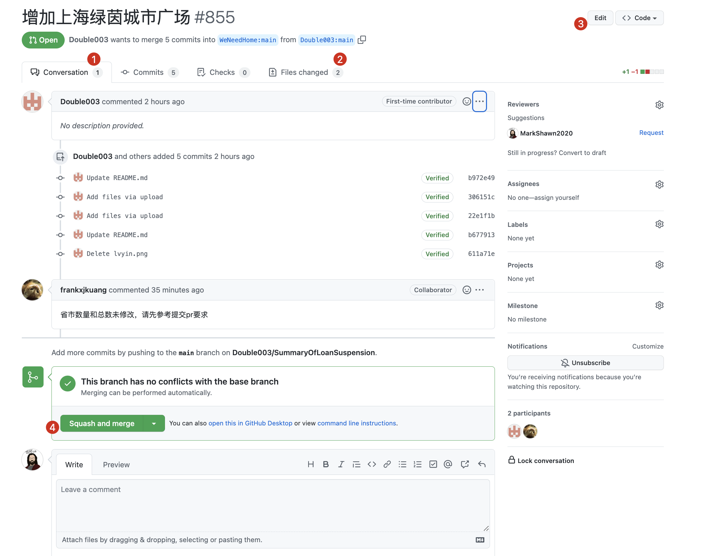  

由于我们的 PR 主要是查看提交的文件变动（而不需要怎么关心别人的代码是如何实现的），因此只需要点击第四个选项 `Files Changed`就行。

在 `Files Change` 页面我们可以看到用户提交的文件与记录整体没有啥毛病，图片已经按要求存放在合适的目录下（即使不太合适，也不要紧），然后链接指向也正确，就是省份和全国合计没跟上。

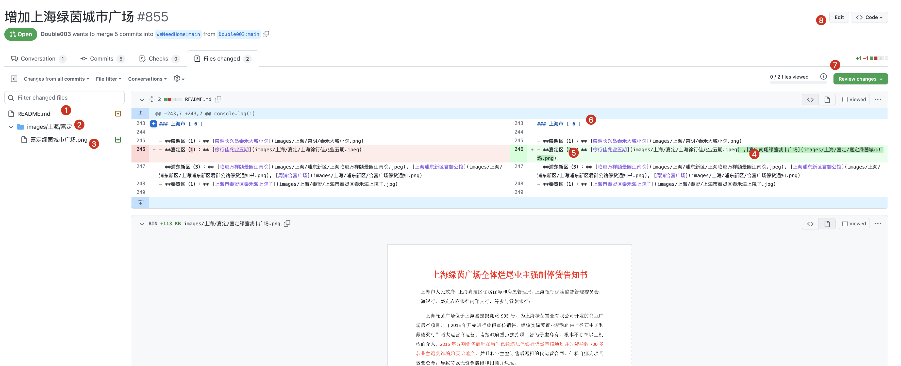  

一般来说有两种办法，第一种是点击 ⑦，反馈 `Request Changed`，即需要修正后才能合并，但如果这招有效，我也就不会费脑细胞写这篇指引了。

首先，我们不能直接合并，不然主分支就乱了，主分支每次的合并，我的建议是，一定是数据正确的合并（即能通过我们的 CI 校验，满屏绿！）

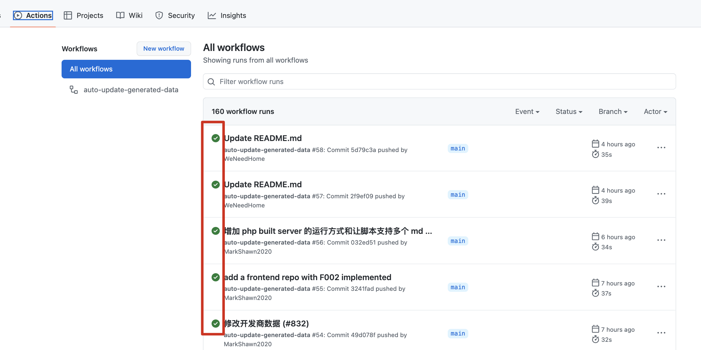  

所以，我们的办法，就是在分支上面合并，然后拉到本地修改，改好后再与主分支合并，确认无误后再推给主分支。

### 步骤一：合并 PR 到副分支

因此我们要用到 ⑧，点击 ⑧ 的 `Edit` 按钮，然后注意，点击那个 `base:main` 的下拉菜单，然后选择 `branch-for-unqualified-pr`。顾名思义，就是专门解决 pr 冲突的分支。

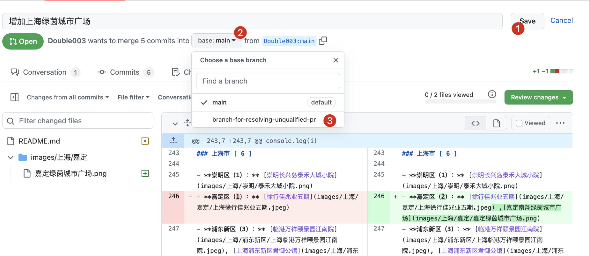  

选择确认：

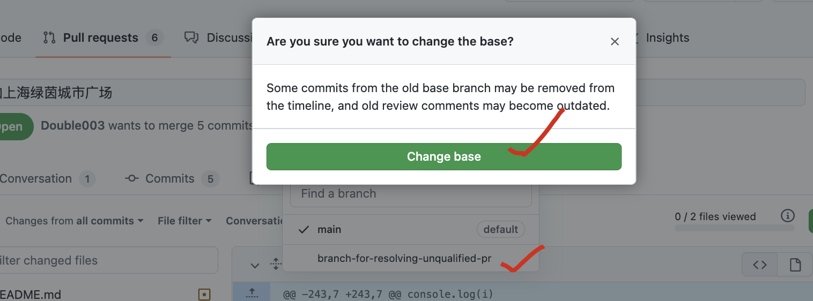  

成功后会提示已经将分支改成 `branch-for-unqualified-pr` 了。

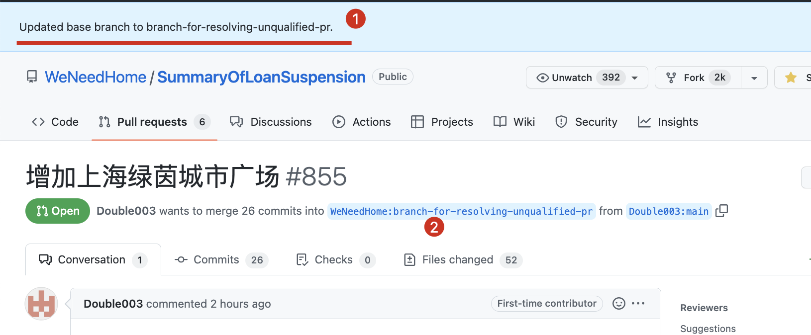  

这个时候，再 merge 这个 pr，就不会合并到主分支了。

于是，选择 `squash and merge`，意思就是把用户的 commits 压缩成一条然后合并。毕竟很多朋友的 commits 比较乱，压缩后 git 树就会比较干净。

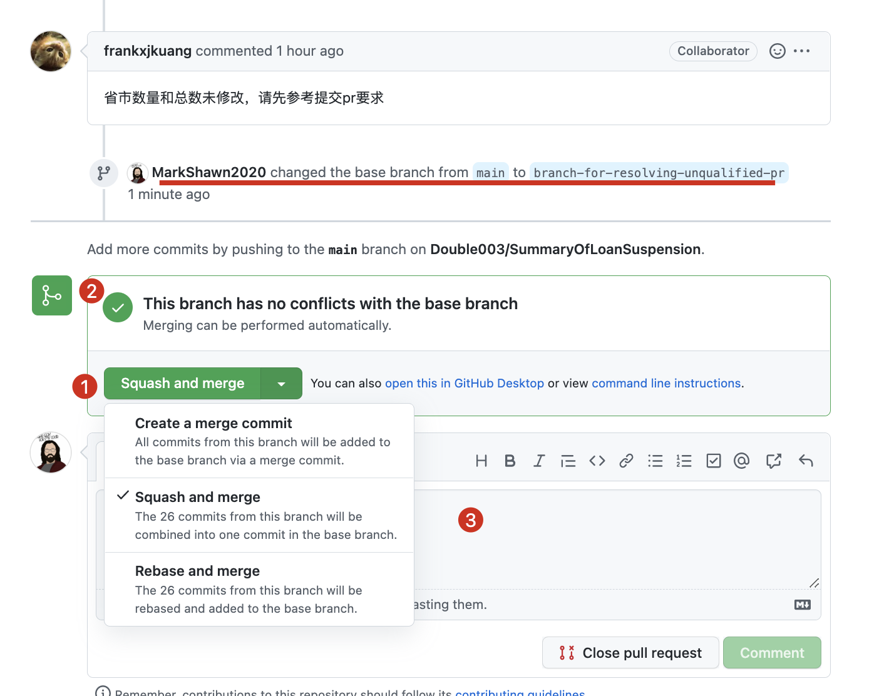  

确保已经没有太大问题了，就可以合并了：

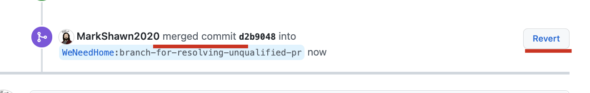  

### 步骤二：设置副分支环境（仅在首次需要）

接着我们就要拉取副分支。

平常我们的开发，应该首先至少有一个 `remotes/origin/main`，就是所谓的 `forked repo`。（我们都是 `fork` 主仓库后再修改，再提交，然后发起合并的）

但为了和主分支交互，我们还需要有一个 `upstream`，也就是我们的 `WeNeedHome/SummaryOfLoanSuspension`。

办法很简单，一行命令搞定，就是把 `upstream` 添加进 `remote` 列表内（已添加过就不用了）

```sh
git remote add upstream https://github.com/WeNeedHome/SummaryOfLoanSuspension
```

检测副分支是否已加入本地 remotes 列表：

```sh
git branch -a
```

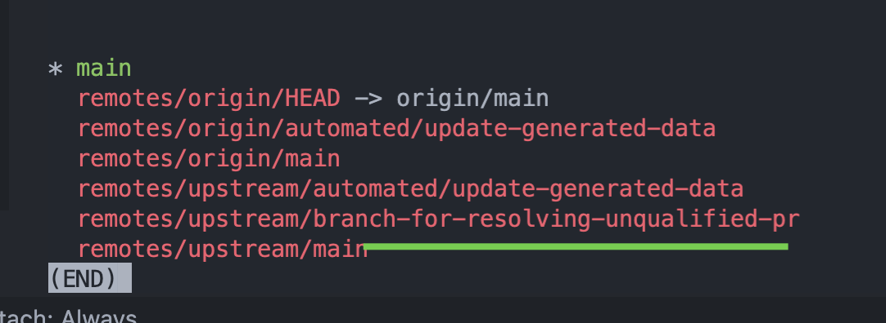  

:smile:，那个 `update-generated-data` 不用管，是我们的 CI，它的出现一般表示有文件冲突了。由于`branch-for-resolving-unqualified-pr`分支只在修正其他人的PR时才用，所以经常与主分支不同步，从而产生冲突，这个问题不大，改完推上去让它不定时同步好就行了。

添加完成之后，就是和远程同步一下了：

```sh
git fetch upstream
```

你应该会看到类似如下的输出：

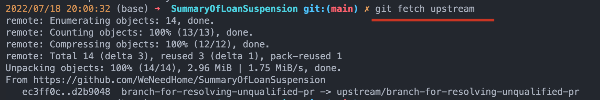  

这时候我们应该就有远程最新的 commits 记录了，可以用 `glola`（`glola`是个 alias，建议写入 bash）验证一下：

```sh
# 每个人的 glola 可能具体写法都不一样，这是我定制的效果
git log --graph --pretty='%Cred%h%Creset -%C(auto)%d%Creset %s %Cgreen(%ar) %C(bold blue)<%an>%Creset' --all
```

可以看到第一个就是我们待合并的分支记录了：

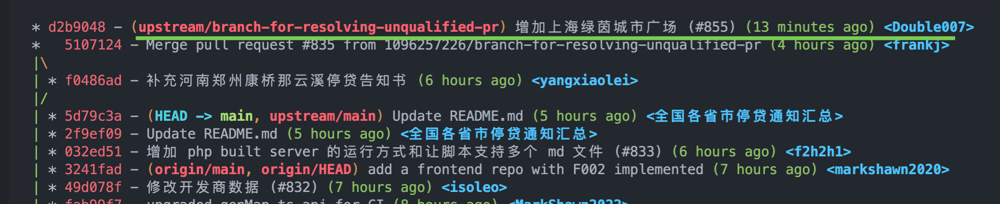  

### 步骤三：拉取副分支以解决冲突

提示：如果你懒得打这么长的名字（不好意思，我倾向于可读性好的名字，而非短的名字），也可以在输入完 `git pull upstream b` 之后按一下 TAB 键，一般就会自动补全了（前提是 upstream 已经同步好了）。

```sh
git pull upstream branch-for-resolving-unqualified-pr
```

拉完之后可以看到 README.md 有冲突（这是正常的，我们正是要解决这个：

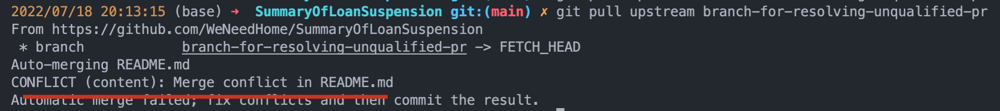  

解决冲突的办法有很多种，每个人都有自己的习惯，我倾向于使用 jetbrains 家的 UI 操作，偶尔也会用纯文本编辑器检查那些杠杠（有冲突的文件一般都是红色， vscode中也是如此）：

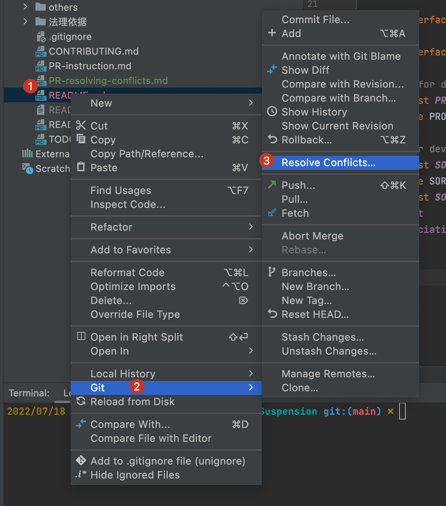  

然后选择“合并”按钮：

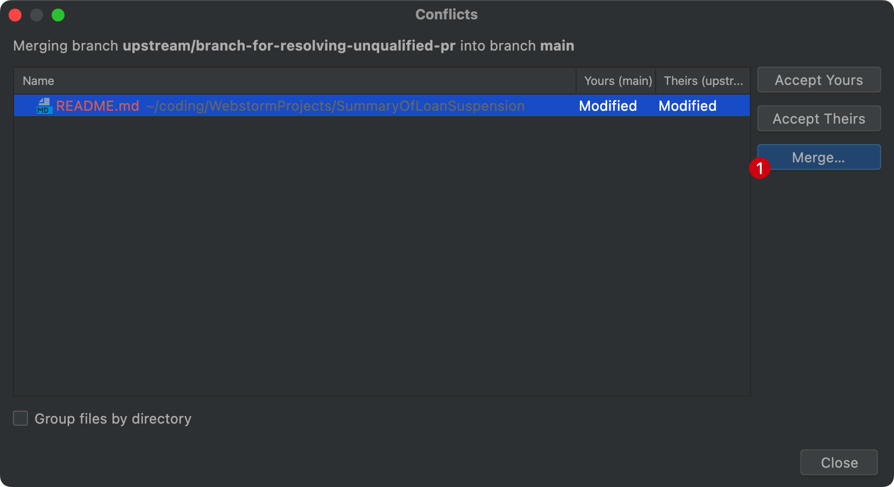  

接着就是来到梦幻冰工厂的时刻：

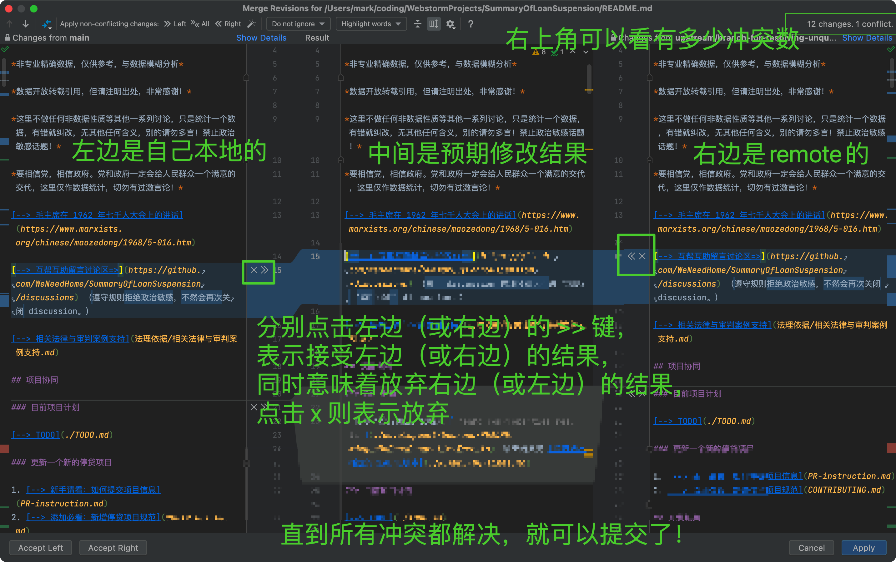  

蓝色的冲突就还好，随便选哪边都差不多，重要的是红色部分的修改，也是我们的目标冲突处：

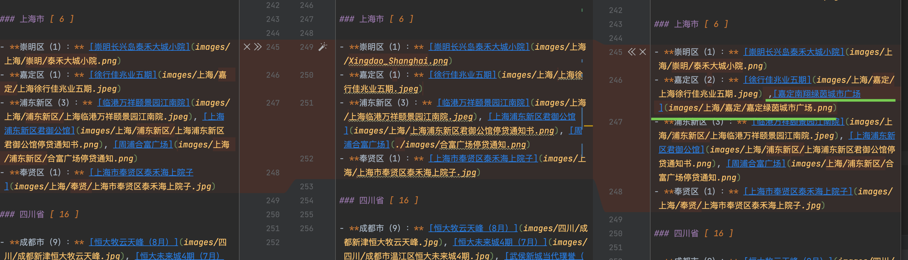  

接收任意一边之后会发现，总数都不对，所以我们在中间那一栏手动加个一：

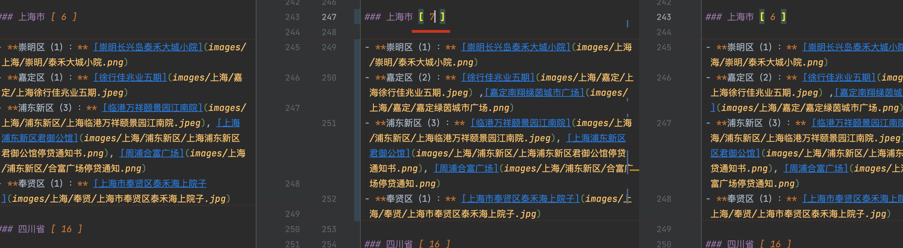  

同时，（显然地），我们要把这个加一也加到全国合计处：

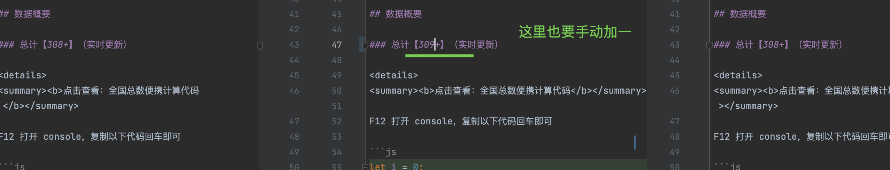  

至此，我们的冲突就已经全部解决好了。

### 步骤四（可选）：程序化验证计数

```sh
cd development/backend
# 没有安装ts-node前要， npm i && npm i -g ts-node
ts-node src/genProperties.ts
```

程序输出结果表示，有三个错误，并且是和上海有关的：

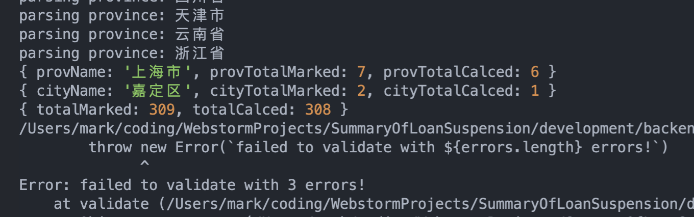  

我们回头看一下，原来是因为楼盘之间的分隔符不对（目前程序约定是用`, `英文逗号+空格，而这里是` ,`，所以分隔错误，之所以这么约定有一定的苦衷，是为了能更好的支持在楼盘信息里写入中文逗号相关的内容，这样的约定不一定是未来的标准，但对于我个人格式化与检查文档很有帮助，至少能保证我每次提交的readme都是标准化后的结果）：

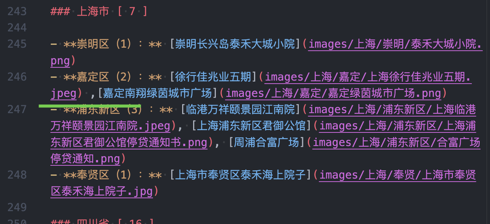  

我们修正后再次运行：

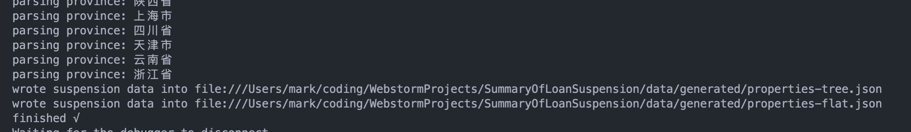  

TADA !

### 步骤五（可选）：本地运行一整套 CI 检查

我们云端的 CI 实际要检查的东西可不止 readme 文档的计数，它比如说还包括自动生成按行排布的 readme，以及检查本地图片的索引，我们试着在本地运行一下：

```sh
cd src
ts-node genProperties.ts  # 生成停贷数据（同时生成tree与flat）
ts-node validateLocalImages.ts      # 验证本地图片索引
ts-node genMarkdown.ts  # tree --> 新的readme
```

看吧，竟然还藏着错误呢！原来还有一张图没链接上！

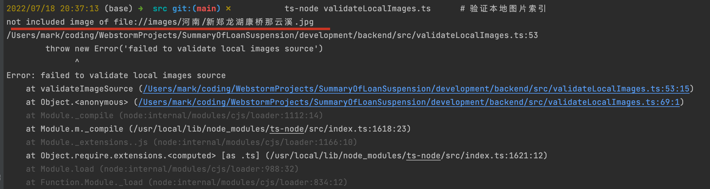  

搜索一下，原来是 `.jpeg` 和 `.jpg`（此处应该还有`狗头.gif`）

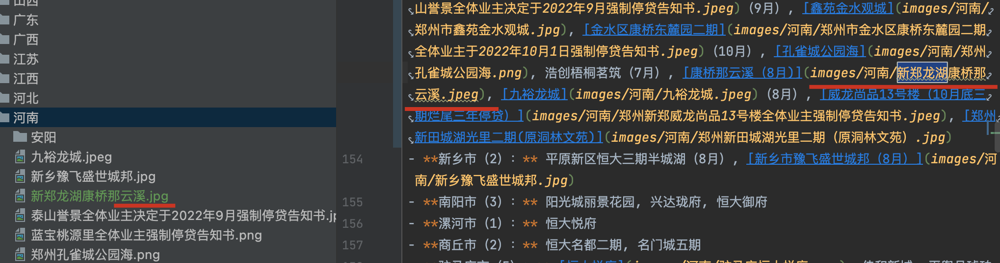  

这点问题，划划水啦~

文档里改成 `.jpg` 就好。

再次运行

```sh
ts-node genProperties.ts  # 生成停贷数据（同时生成tree与flat）
ts-node validateLocalImages.ts      # 验证本地图片索引
ts-node genMarkdown.ts  # tree --> 新的readme
```

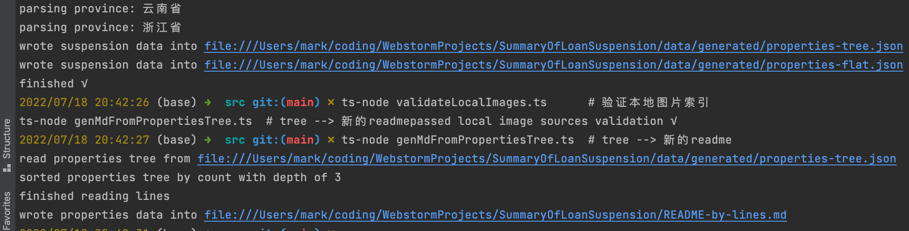  

TADA !

### 步骤六：提交并合入

首先先推到自己的仓库：

```
git add -A
git commit
git push origin main
```

如下，冇问题啊：

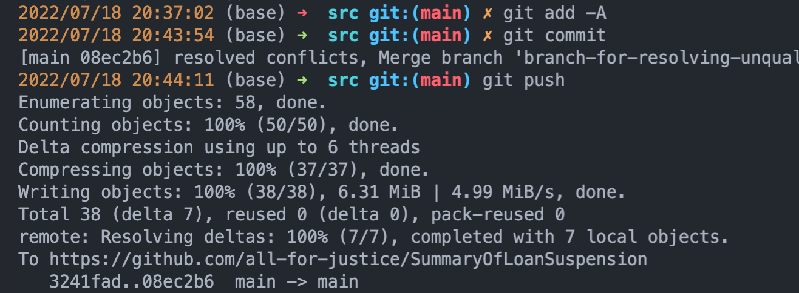  

这个时候就要和主仓库开始交互了，我们先拉取一下最新的，因为主仓库在我们改动本地文件时期，可能已经有人动过了：

```sh
git pull upstream main
```

不过幸运的是，在我们写这篇文章时没有：

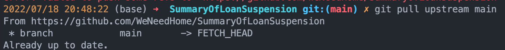  

那就，so easy 啦：

```sh
git push upstream main
```

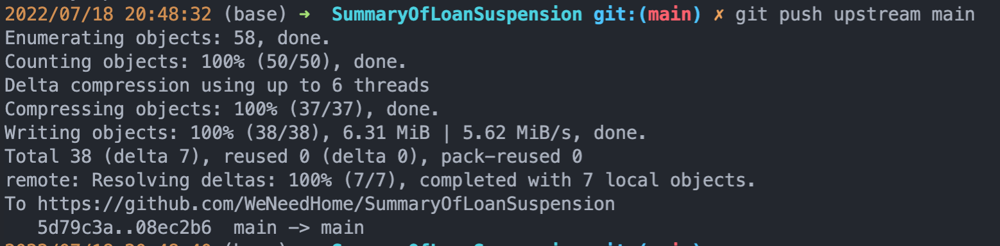  

至此，所有冲突都已经，并且可以保证有效，不放心的还可以去 [Action Page](https://github.com/WeNeedHome/SummaryOfLoanSuspension/actions) 看一看：

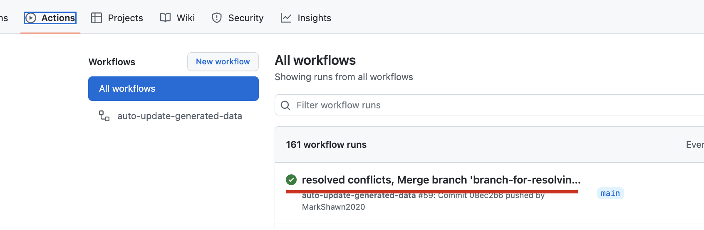  


## At Last

感谢阅读到最后，不容易！

祝全体早日有房！（其实我自己并没有房，但作为坚定的无产阶级，我必须挺你们，尽管这并不能帮助我降低自己的租金，lol）

（by the way，明天正好是我生日啦，回想起来这两天与 WeNeedHome 的点点滴滴，还是会心潮澎湃，尽管接下来我可能会逐步降低维护的频率了。）

我相信很多人都像最近爆火的那对年轻小夫妻一样，也是曾经心里有海，眼里有光。

所以，快乐是如何消失了的呢。
