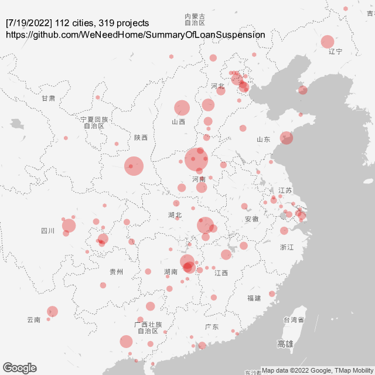
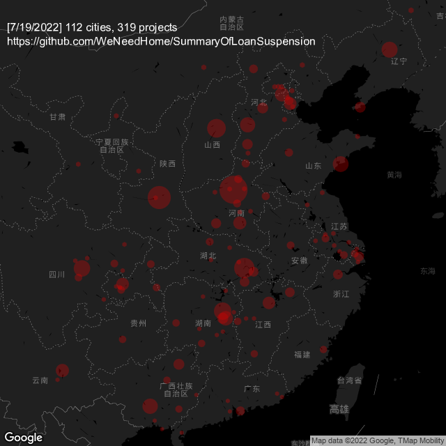

# 全国各省市烂尾楼停贷通知汇总

## 数据来源统计以及发起人： 已被封禁

*非专业精确数据，仅供参考，与数据模糊分析*

*数据开放转载引用，但请注明出处，非常感谢！*

*这里不做任何非数据性质等其他一系列讨论，只是统计一个数据，有错就纠改，无其他任何含义，别的请勿多言！禁止政治敏感话题！*

*要相信党，相信政府。党和政府一定会给人民群众一个满意的交代，这里仅作数据统计，切勿有过激言论！*

[--> 毛主席在 1962 年七千人大会上的讲话](https://www.marxists.org/chinese/maozedong/1968/5-016.htm)

[--> 互帮互助留言讨论区=>](https://github.com/WeNeedHome/SummaryOfLoanSuspension/discussions)
（遵守规则拒绝政治敏感，不然会再次关闭 discussion。）

[--> 相关法律与审判案例支持](相关法律与审判案例支持.md)

## 项目协同

### 计划

[--> TODO](./TODO.md)

### 提交

1. [--> 1. 新手请看：如何提交项目信息](PR-instruction.md)
2. [--> 2. 添加请看：新增停贷项目规范](CONTRIBUTING.md)
3. [--> 3. 冲突请看：如何修正提交冲突](PR-resolving-conflicts.md)

其中，提交之前请确保验证能过：

```shell
sh ./run-validate.sh
``` 

### 开发

- [--> 后端](development/backend/README.md)
- [--> 前端](development/frontend/README.md)

1. :sparkles:
   本项目已集成CI，将自动核验数据的统计准确性，具体见：[backend-nodejs](./development/backend/nodejs/README.md)

2. :rocket: 20220719
   已实现开发商数据抓取，但还需要更多的单元测试与样本测试，具体见：[爬虫开发者急集令🚀 #950](https://github.com/WeNeedHome/SummaryOfLoanSuspension/discussions/950)

3. :zap: 20220720 升级 readme 文档，已支持（与推荐）换行编辑楼盘信息

4. 20220721：
   1. :rocket: 增加了一个基于 dotnet 实现的 GitHub proxy，详见 [#953](https://github.com/WeNeedHome/SummaryOfLoanSuspension/pull/953)
   2. :sparkles: 升级了地图，显示中文水印，在 readme 中直接查看即可

## 数据概要

### 结构化数据

- [楼盘停贷数据(FLAT版)](data/generated/properties-flat.json)（含省市区、链接）
- [楼盘停贷数据(TREE版)](data/generated/properties-tree.json)（含省市区、链接）
- [城市停贷数据](data/generated/cities-for-visualization.json)（含省市区、楼盘统计数、经纬度）

### 全国停贷地图

<details>
<summary><b>点击查看：全国停贷地图（浅色）</b></summary>

</details>

<details>
<summary><b>点击查看：全国停贷地图（深色）</b></summary>

</details>

### 其他数据公示处

- ~~项目发起人~~ (被 ban 了）

- ~~[我来文档](https://www.wolai.com/xutejcDgz9B3aTcrRCjxB1)~~ （20220717已无查看权限）

- ~~[Notion 数据库](https://www.notion.so/21dab14200e2478eb91c49b68d16495f)~~ (
  20220717已被恶意删除)

## 分省数据 (总计：【**319+**】，按三级拼音升序）

### 安徽省 [ 2 ]

- **合肥市（2）：** 
  恒大中心（8月）,
  斯瑞大厦

### 北京市 [ 3 ]

- **朝阳区（1）：** 
  [上东郡（澜悦景苑）](images/北京市/朝阳区/澜悦景苑.jpeg)
- **石景山区（1）：** 
  [禧悦学府（悦创佳苑）](images/北京市/石景山区/禧悦学府.jpeg)
- **通州区（1）：** 
  [禹洲朗廷湾（朗廷雅苑）](images/北京市/通州区/北京禹洲朗廷湾.jpeg)

### 重庆市 [ 12 ]

- **巴南区（2）：** 
  恒大新城四期,
  [世茂·江城铭著](images/重庆市/巴南区/世茂江城铭著.jpg)
- **璧山区（1）：** 
  [璧山区融创城（9月）](images/重庆市/璧山区/重庆_璧山_融创城.jpg)
- **黔江区（2）：** 
  富力院士延琅境,
  恒大名都（7月）
- **沙坪坝区（1）：** 
  [佳兆业·凤鸣水岸（9月）](images/重庆市/沙坪坝区/重庆_佳兆业凤鸣水岸.jpg)
- **万州区（1）：** 
  万萃城二期（12月）
- **渝北区（5）：** 
  芙蓉公馆（9月）,
  恒大轨道时代二期,
  蓝光未来城,
  [融创隐溪晓院一二三期](images/重庆市/渝北区/重庆市渝北区融创隐溪晓院全体业主强制停贷预告书.png),
  [阳城未来悦二期（7月）](images/重庆市/渝北区/阳城未来悦二期.jpg)

### 福建省 [ 2 ]

- **福州市（2）：** 
  恒大天璟二期,
  [天泽奥莱时代（8月）](images/福建省/福州市/福州市奥莱时代.jpg)

### 甘肃省 [ 2 ]

- **兰州市（1）：** 
  [兰州新区绿地智慧金融城六期康养谷](images/甘肃省/兰州市/兰州新区绿地智慧金融城六期康养谷.jpeg)
- **庆阳市（1）：** 
  国金one（11月）

### 广东省 [ 8 ]

- **广州市（1）：** 
  [万科海上明月（9月）](images/广东省/广州市/gz001.png)
- **揭阳市（1）：** 
  恒大翡翠华庭二期
- **汕头市（1）：** 
  恒大金碧外滩湾（八月）
- **深圳市（3）：** 
  佳兆业时代大厦,
  [佳兆业樾伴山](images/广东省/深圳市/sz001.jpg),
  [前海天境花园](images/广东省/深圳市/sz003.jpg)
- **湛江市（1）：** 
  [吴川奥园冠军城一期](images/广东省/湛江市/_吴川奥园冠军城一期)
- **中山市（1）：** 
  泰禾金尊府

### 广西壮族自治区 [ 20 ]

- **北海市（1）：** 
  [融创海映兰屿三期](images/广西壮族自治区/北海市/广西北海市融创海映兰屿三期业主集体中止还贷告知书.png)
- **桂林市（4）：** 
  [桂林恒大城（10月）](images/广西壮族自治区/桂林市/桂林恒大城.jpg),
  [桂林融创文旅城N4地块](images/广西壮族自治区/桂林市/_桂林融创文旅城N4地块),
  灵川汇金万象新城（11月）,
  [融创文旅城N7地块（10月）](images/广西壮族自治区/桂林市/桂林融创N7.png)
- **柳州市（2）：** 
  [恒大城二期、三期](images/广西壮族自治区/柳州市/柳州恒大二三期停贷.jpg),
  [鹿寨县麓湖公园里](images/广西壮族自治区/柳州市/鹿寨县麓湖公园里全体业主决定于2022年8月20日强制停贷告知书.jpg)
- **南宁市（9）：** 
  [东鼎雍和府（9月）](images/广西壮族自治区/南宁市/南宁东鼎雍和府.png),
  江宇世纪公馆,
  金科博翠山,
  蓝光雍锦澜湾,
  [南宁恒大华府二期](images/广西壮族自治区/南宁市/南宁恒大华府二期告知书.png),
  融创融公馆11、12号楼（8月）,
  [五象澜庭府沁苑](images/广西壮族自治区/南宁市/南宁市五象澜庭府沁苑.png),
  五象澜庭府臻苑,
  [中鼎公园府](images/广西壮族自治区/南宁市/广西省南宁市中鼎公园府全体业主强制停贷告知书.png)
- **钦州市（1）：** 
  恒大御景半岛二期
- **梧州市（1）：** 
  [恒大绿洲二期（8月）](images/广西壮族自治区/梧州市/梧州恒大二期停贷.png)
- **玉林市（2）：** 
  [北流市三环新城二期](images/广西壮族自治区/玉林市/玉林北流市三环新城停贷.png),
  中鼎绿地中心

### 贵州省 [ 2 ]

- **贵阳市（2）：** 
  中环国际阅湖,
  中天吾乡

### 河北省 [ 22 ]

- **保定市（3）：** 
  [隆基泰和涿州铂悦山](images/河北/保定/隆基泰和涿州铂悦山项目全体业主强制停贷告知书.jpeg),
  [隆基泰和涿州紫悦小区](images/河北/保定/涿州市隆基泰和紫悦小区.jpeg),
  上东御景
- **沧州市（1）：** 
  [紫樾香榭](images/河北/沧州/沧州市紫樾香榭全体业主强制停贷告知书.jpeg)
- **承德市（1）：** 
  状元府
- **邯郸市（1）：** 
  [恒大悦珑湾](images/河北/邯郸/邯郸恒大.jpg)
- **廊坊市（5）：** 
  鸿坤凤凰城五期（8月）,
  鸿坤理想城,
  [华夏幸福·四季公馆](images/河北/廊坊/河北廊坊市大厂回族自治县四季公馆强制停贷告知书.jpeg),
  华夏幸福孔雀城大运河智慧街区（香河）,
  盈时·未来港
- **石家庄市（6）：** 
  [安联生态城凯旋府](images/河北/石家庄/石家庄市安联生态城凯旋府全体货款业主强制停货告知书.jpeg),
  恒大时代新城（8月）,
  恒大悦龙台,
  恒润中央广场,
  [石家庄赫石府](images/河北/石家庄/石家庄市赫石府全体货款业主强制停货告知书.png),
  [众美定制广场](images/河北/石家庄/_众美定制广场)
- **邢台市（3）：** 
  恒大悦府,
  [天山熙湖二期_名玉家园（待停贷）](images/河北/邢台/天山熙湖二期_名玉家园停贷告知书.png),
  永康万国城
- **张家口市（2）：** 
  宣化恒大滨河左岸,
  宣化恒大翡翠湾

### 河南省 [ 62 ]

- **安阳市（2）：** 
  恒大悦府,
  紫薇公馆
- **开封市（1）：** 
  [郑开恒大未来城三期](images/河南/郑开恒大未来城三期全体业主决定于2022年8月份强制停贷告知书.png)
- **洛阳市（1）：** 
  恒大云湖上郡
- **漯河市（1）：** 
  恒大悦府
- **南阳市（3）：** 
  恒大御府,
  兴达珑府,
  阳光城丽景花园
- **商丘市（2）：** 
  恒大名都二期,
  名门城五期
- **新乡市（2）：** 
  平原新区恒大三期半城湖（8月）,
  [新乡市豫飞盛世城邦（8月）](images/河南/新乡豫飞盛世城邦.jpg)
- **荥阳市（1）：** 
  居易西郡
- **许昌市（2）：** 
  金科鹿鸣帝景,
  融创观河宸院
- **郑州市（41）：** 
  奥园御湖城,
  奥园悦城（汇景园）,
  瀚海思念城,
  浩创梧桐茗筑（7月）,
  恒大城,
  恒大养生谷,
  华纳龙熙湾,
  [金水区康桥东麓园二期](images/河南/郑州市金水区康桥东麓园二期全体业主于2022年10月1日强制停贷告知书.jpeg),
  锦艺轻纺四期未来公寓,
  [九裕龙城](images/河南/九裕龙城.jpeg),
  康桥玖玺园,
  [康桥那云溪（8月)](images/河南/新郑龙湖康桥那云溪.jpg),
  康桥未来公元,
  康桥香溪郡,
  康桥阅溪雅苑,
  [孔雀城公园海](images/河南/郑州孔雀城公园海.png),
  [蓝宝桃源里](images/河南/蓝宝桃源里全体业主强制停贷告知书.png),
  龙湖锦艺城高六,
  龙湖一号（9月）,
  绿地滨湖国际城,
  绿地城二区（7月）,
  绿地溱水小镇,
  名门翠园,
  名门天境,
  名门紫园,
  啟福城,
  清华城（7月）,
  [融创中原大观二期](images/河南/郑州市融创中原大观二期停贷告知书.png),
  盛润城壹号公馆,
  [泰山誉景朗誉园](images/河南/泰山誉景全体业主决定于2022年9月强制停贷告知书.jpeg),
  [威龙尚品13号楼（10月底三期烂尾三年停贷）](images/河南/郑州新郑威龙尚品13号楼全体业主强制停贷告知书.jpeg),
  [新郑市浩创城](images/河南/浩创城告知书.png),
  [鑫苑金水观城](images/河南/郑州市鑫苑金水观城.jpg),
  [鑫苑名城3号院住宅](images/河南/郑州鑫苑名城3号院住宅项目.png),
  永恒理想世界三期（9月）,
  [豫发白鹭源春晓三期](images/河南/郑州航空港区豫发白鹭源春晓三期全体业主停贷告知书.jpg),
  正商玖号院,
  郑西鑫苑名家四期（7月）,
  [郑州融创御湖宸院三期](images/河南/郑州融创御湖宸院三期.png),
  [郑州新田城湖光里二期(原洞林文苑)](images/河南/郑州新田城湖光里二期（原洞林文苑）.jpg),
  [郑州鑫苑国际新城](images/河南/郑州鑫苑国际新城.jpg)
- **周口市（1）：** 
  槐府六号三期
- **驻马店市（5）：** 
  [恒大悦府](images/河南/驻马店恒大悦府.png),
  佳和新城,
  平舆县琥珀蓝岸（10月）,
  遂平县绿地苑,
  中原城

### 湖北省 [ 27 ]

- **鄂州市（3）：** 
  鄂州市花样年香门第,
  恒大童世界四号地（廊桥水乡）（9月）,
  恒大文化旅游城
- **荆门市（1）：** 
  实地紫薇雅著
- **随州市（1）：** 
  恒大悦龙台（10月）
- **武汉市（16）：** 
  [奥山汉口澎湃城](images/湖北/武汉/武汉东西湖奥山汉口澎湃城.jpg),
  奥山经开澎湃城（7月）,
  [奥山首府](images/湖北/武汉/奥山首府（奥山郡）.png),
  当代铭山筑,
  [光谷绿地中心城JKL地块](images/湖北/武汉/光谷绿地中心城JKL地块.png),
  [汉南绿地城二期](images/湖北/武汉/汉南绿地城二期.png),
  [恒大科技城（8月）](images/湖北/武汉/恒大科技旅游城.png),
  [恒大龙城四期](images/湖北/武汉/恒大龙城四期.png),
  [恒大时代新城（8月）](images/湖北/武汉/恒大时代新城.png),
  君悦花园（知音湖院子）,
  [绿地光谷星河绘](images/湖北/武汉/绿地光谷星河绘.jpg),
  绿地光谷中心城,
  [美好香域花境](images/湖北/武汉/美好香域花境.jpg),
  [人福国际健康城（7月）](images/湖北/武汉/人福国际健康城.png),
  泰禾知音湖院子,
  新洲中新盛景
- **咸宁市（3）：** 
  恒大名都,
  联乐广场,
  绿地城际空间站
- **襄阳市（2）：** 
  恒大翡翠龙庭一期（8月）,
  蓝光雍锦园
- **孝感市（1）：** 
  润达·壹号广场

### 湖南省 [ 33 ]

- **常德市（1）：** 
  [汉寿县山湖海上城二期、三期](images/湖南/常德市汉寿县山湖海上城二期、三期全体业主停贷告知书.jpeg)
- **衡东县（1）：** 
  奥体公馆
- **衡阳市（1）：** 
  华源北街
- **怀化市（2）：** 
  恒大帝景,
  恒大中央广场（8月）
- **浏阳市（1）：** 
  恒大华府四期
- **邵阳市（1）：** 
  恒大华府（9月）
- **湘潭市（4）：** 
  [和达滨江公园](images/湖南/湘潭市和达滨江花园强制停贷书.jpg),
  恒大书香门第15、16栋,
  [金奥湘江公馆](images/湖南/湘潭金奥湘江公馆一二期停贷告知函.jpg),
  湘台国际花园二期
- **永州市（2）：** 
  道县东方丽都三期（永州道县）,
  舜德湘江
- **岳阳市（1）：** 
  恒大未来城二期（8月）
- **长沙市（11）：** 
  滨江正荣紫阙台,
  [富力园康商业广场](images/湖南/长沙富力园康商业广场全体业主决定于2022年11月强制停贷告知书.jpeg),
  合能枫丹宸悦,
  合能湘江公馆,
  恒大滨江左岸,
  恒大御景天下二期（8月）,
  恒大悦湖商业广场（12月）,
  [恒泰芙蓉悦府](images/湖南/湖南省长沙市恒泰芙蓉悦府全体业主停贷告知书.jpg),
  [宁乡未来方舟2期&3期](images/湖南/宁乡未来方舟.jpg),
  新力铂园（8月）,
  长沙文景
- **株洲市（7）：** 
  北大资源翡翠公园,
  诚建檀香山,
  东成中心1栋,
  [华晨金水湾三四期](images/湖南/湖南株洲.jpg),
  [华晨神农府](images/湖南/株洲市华晨神农府全体业主强制停货告知书.jpeg),
  华晨神农湾,
  绿地城际空间站
- **郴州市（1）：**
  [郴州鲲鹏商贸城](images/湖南/郴州/郴州鲲鹏商贸城强制停贷通知.png)

### 吉林省 [ 1 ]

- **公主岭市（1）：** 
  恒大花溪谷或水世界

### 江苏省 [ 12 ]

- **常州市（1）：** 
  三盛璞悦湾
- **连云港市（1）：** 
  [恒泰悦珑府](images/江苏/连云港/恒泰悦珑府.png)
- **南京市（1）：** 
  金陵华夏中心（8月）
- **南通市（1）：** 
  阳光城未来悦
- **苏州市（2）：** 
  [泰禾金尊府（8月)](images/江苏/苏州/苏州泰禾金尊府.jpg),
  [阳光城檀苑](images/江苏/苏州/苏州阳光城檀苑.jpg)
- **宿迁市（1）：** 
  恒大悦澜湾
- **泰州市（1）：** 
  恒大御景半岛
- **无锡市（1）：** 
  天渝骄园
- **扬州市（1）：** 
  [恒大观澜府](images/江苏/扬州/扬州恒大观澜府.jpg)
- **镇江市（2）：** 
  恒大童世界,
  [句容市宝华镇泰禾金尊府](images/江苏/镇江/镇江市句容市宝华镇-泰禾金尊府.jpg)

### 江西省 [ 14 ]

- **赣州市（2）：** 
  绿地博览城,
  [于都县恒大御景北区](images/江西/赣州市于都县恒大御景北区业主强制停贷告知书.png)
- **景德镇市（3）：** 
  恒大翡翠华庭,
  恒大珑庭,
  恒大悦府
- **南昌市（5）：** 
  恒大珺庭（8月）,
  恒大林溪府（10月）,
  鸿海城（10月）,
  新力城,
  中金中心
- **萍乡市（2）：** 
  恒大御府二期,
  庄和中央华府（10月）
- **新余市（1）：** 
  恒大翡翠华庭（9月）
- **宜春市（1）：** 
  恒大绿洲四期

### 辽宁省 [ 9 ]

- **大连市（3）：** 
  [大连市鑫创科技健康小镇（包括鑫苑藏龙首付一期、二期）](images/辽宁/大连鑫苑.jpg),
  [融创海逸长洲](images/辽宁/大连融创海逸长洲.jpg),
  香海滨城二期
- **沈阳市（6）：** 
  [恒大盛京珺庭](images/辽宁/沈阳恒大盛京珺庭.png),
  恒大时代新城,
  [恒大文化旅游城](images/辽宁/沈阳恒大文化旅游城全体业主强制停货告知书.jpeg),
  恒大西江天悦,
  [恒大中央广场](images/辽宁/沈阳恒大中央广场.jpg),
  金科集美东方

### 内蒙古自治区 [ 1 ]

- **呼和浩特市（1）：** 
  香墅岭西区（10月）

### 宁夏回族自治区 [ 1 ]

- **银川市（1）：** 
  [恒大珺睿府](images/宁夏/银川/银川市恒大珺睿府.png)

### 山东省 [ 10 ]

- **济南市（2）：** 
  [融创中新国际城四期南区](images/山东/济南/融创中新国际城四期南区.jpeg),
  [阳光城檀悦](images/山东/济南/阳光城檀悦.jpeg)
- **青岛市（7）：** 
  [黄岛蓝光雍锦半岛（6月)](images/山东/青岛/蓝光雍锦半岛.jpeg),
  [胶州协信天骄云麓](images/山东/青岛/胶州协信天骄云麓.jpeg),
  [绿地城际空间站（9月）](images/山东/青岛/绿地城际空间站.png),
  [三盛国际海岸五期（9月）](images/山东/青岛/三盛国际.jpeg),
  [实地蔷薇国际](images/山东/青岛/实地蔷薇国际.jpeg),
  [西海岸新区世茂•香奈公馆（10月）](images/山东/青岛/青岛西海岸新区世茂•香奈公馆.jpeg),
  [中南林樾小区（7月）](images/山东/青岛/李沧中南林樾.jpg)
- **烟台市（1）：** 
  [松隽阳光城（12月）](images/山东/烟台/松隽阳光城.jpeg)

### 山西省 [ 10 ]

- **太原市（10）：** 
  宝能城一期（8月）,
  [恒大滨河府二期](images/山西/太原/太原恒大滨河府二期全体业主决定千2022年9月强制停贷告知书.jpeg),
  恒大金碧天下八期（10月）,
  恒大金碧天下五期（八月）,
  [恒大森林海一期](images/山西/太原/太原恒大森林海一期全体业主强制停贷告知书.jpeg),
  [绿地新里城二期](images/山西/太原绿地新里程.jpg),
  [太原富力天禧城3期](images/山西/太原市富力天禧城3期.jpg),
  [太原市恒大御景湾4期](images/山西/太原市恒大御景湾4期.jpg),
  [太原市融创中心](images/山西/太原市融创中心.png),
  泰禾金尊府

### 陕西省 [ 22 ]

- **西安市（21）：** 
  [当代嘉宝公园悦](images/陕西/西安/当代嘉宝公园悦停贷告知书.png),
  德杰状元府邸（9月）,
  国际幸福城,
  鄠邑区名仕华庭,
  [锦业6号府邸](images/陕西/西安/西安锦业6号府邸停贷通知书.png),
  乐华城香榭庄园,
  绿地璀璨天城二期,
  [绿地新里程三期兰亭公馆](images/陕西/西安/西安绿地兰亭公馆全体业主强制停贷告知书.png),
  [世茂璀璨倾城二期](images/陕西/西安/西安世茂璀璨倾城二期停贷告知书.png),
  [万和郡](images/陕西/西安/西安万和郡停贷告知.png),
  西安灞桥区易合坊,
  [西安当代境MOMA](images/陕西/西安/西安当代境MOMA项目预停贷告知书.png),
  [西安沣东新城君合天玺](images/陕西/西安/西安沣东新城君合天玺.jpeg),
  [西安恒大文化旅游城（8月）](images/陕西/西安/西安恒大文化旅游城强制停贷告知书.jpeg),
  [西安康桥悦蓉园（9）](images/陕西/西安/西安康桥悦蓉园13号楼停贷告知函.png),
  [西安名京院望](images/陕西/西安/西安名京院望停贷告知书.jpg),
  西安铭鸿中心二期,
  [西安远洋合能枫丹唐悦二期（待停贷）](images/陕西/西安/西安远洋合能枫丹唐悦二期强制停贷告知书.jpeg),
  阳光100阿尔勒（8月）,
  [正荣紫阙峯著](images/陕西/西安/西安正荣紫阙峯著全体业主强制停贷告知书.png),
  正荣紫阙台
- **咸阳市（1）：** 
  [融创御河宸院DK6](images/陕西/咸阳/咸阳融创御河宸院DK6全体业主停货告知书.png)

### 上海市 [ 7 ]

- **崇明区（1）：** 
  [崇明长兴岛泰禾大城小院](images/上海/崇明/泰禾大城小院.png)
- **奉贤区（1）：** 
  [上海市奉贤区泰禾海上院子](images/上海/奉贤/上海市奉贤区泰禾海上院子.jpg)
- **嘉定区（2）：** 
  [嘉定南翔绿茵城市广场](images/上海/嘉定/嘉定绿茵城市广场.png),
  [徐行佳兆业五期](images/上海/嘉定/上海徐行佳兆业五期.jpeg)
- **浦东新区（3）：** 
  [临港万祥颐景园江南院](images/上海/浦东新区/上海临港万祥颐景园江南院.jpeg),
  [上海浦东新区君御公馆](images/上海/浦东新区/上海浦东新区君御公馆停贷通知书.png),
  [周浦合富广场](images/上海/浦东新区/合富广场停贷通知.png)

### 四川省 [ 18 ]

- **巴中市（1）：** 
  恩阳川旅世纪外滩
- **成都市（9）：** 
  [恒大林溪郡（8月）](images/四川/hdlxj.jpg),
  [恒大牧云天峰（8月）](images/四川/成都新津恒大牧云天峰.jpg),
  [恒大未来城4期（7月）](images/四川/成都市温江区恒大未来城4期.jpg),
  [三盛翡俪山（8月）](images/四川/ssfls.jpg),
  [万锦熙岸2期（8月）](images/四川/wjxa2.png),
  [武侯新城当代璞誉（7月）](images/四川/whxcdd.jpg),
  [新尚尚院（10月）](images/四川/成都温江区新尚尚院告知书.png),
  阳光城未来悦,
  置信逸都城（9月）
- **德阳市（1）：** 
  恒大翡翠华庭
- **都江堰市（1）：** 
  融创文旅滨江新区（8月）
- **广安市（1）：** 
  帝谷公园城三期
- **泸州市（1）：** 
  恒大翡翠湾
- **眉山市（2）：** 
  [恒大文化旅游城（10月）](images/四川/眉山市恒大文化旅游城3-14地块全体业主决定于.png),
  [眉山市彭山区融创水郡未来城（江口水镇）（10月）](images/四川/眉山市彭山区融创水郡未来城、江口水镇全体业主决定强制停贷告知书.png)
- **南充市（2）：** 
  [南充大合华府（8月）](images/四川/南充大合华府.png),
  [南充逸合中央公园（8月）](images/四川/南充逸合中央公园.png)

### 天津市 [ 9 ]

- **宝坻区（1）：** 
  [宝坻区实地海棠雅著圣景豪庭](images/天津/天津市实地海棠雅著圣景豪庭.jpeg)
- **北辰区（2）：** 
  [融创津宸壹号](images/天津/天津市津宸壹号全体业主“动态还贷”告知书.png),
  [融创御景宸院](images/天津/天津市北辰区融创御景宸院全体业主强制停贷告知书.png)
- **津南区（1）：** 
  四季春晓
- **天津城区（4）：** 
  融创南开宸院二期,
  实地海棠雅著圣景豪庭（8月）,
  实地蔷薇（9月）,
  [天津天房樾梅江住宅](images/天津/_天津天房樾梅江住宅)
- **武清区（1）：** 
  恒大翡翠湾（10月）

### 云南省 [ 7 ]

- **昆明市（6）：** 
  恒大城（9月）,
  恒大玖珑湾（9月）,
  恒大阳光半岛（9月）,
  佳兆业城市广场（9月）,
  蓝光德商天域（8月）,
  实地花鹤翎（10月）
- **玉溪市（1）：** 
  樱花谷（7月）

### 浙江省 [ 3 ]

- **杭州市（3）：** 
  [富阳区泰禾大城小院楼盘](images/浙江/杭州/浙江省杭州市富阳区泰禾大城小院楼盘富政储出（2010）20号地块购房者暂停还货告知书.jpg),
  [杭州中南春溪集](images/浙江/杭州/浙江杭州中南春溪集.png),
  [中润璞玉公馆](images/浙江/杭州/中润璞玉公馆.png)

## 开发商数据（按拼音排序）

### 恒大 [ * ]

### 绿地 [ * ]

### 融创 [ * ]

### 泰禾 [ * ]

### 石家庄中融汇通房地产开发有限公司 [ * ]

- 关联项目：石家庄赫石府

### 鑫苑 [ * ]

## 其他曝光

- 天渝骄园(延期14个月), 梁溪本源(基本停工), 协信城立方(停工一年多),新力翡翠湾, 梁溪官邸(停工半年)，见：[#900](https://github.com/WeNeedHome/SummaryOfLoanSuspension/pull/900)

- 河北-邢台-皓顺壹号院，见：[#940](https://github.com/WeNeedHome/SummaryOfLoanSuspension/pull/940)

- [贵州中天未来方舟环球谷C1组团烂尾](others/中天未来方舟环球谷C1组团.jpeg)
  ，这楼盘停工两年了，中天城投已经被接管，5月份建了群和业主协调，应该是没告知书的了，http://sc.house.hexun.com/News/details/id/198910.html
  。具体见：[#828](https://github.com/WeNeedHome/SummaryOfLoanSuspension/pull/828)

- [河南安阳恒大未来城（待停贷）](others/_河南安阳恒大未来城)

- [湖北省恒大供应商、小微企业断贷停工告知书](others/湖北省恒大供应商、小微企业断贷停工告知书.png)

- 
赣榆区香港城、华中郡府等：这些盘已有十年以上历史，不知道相关业主利益是否解决，因此借此机会也放上来。具体见：[大家来说说赣榆的烂尾楼_赣榆吧_百度贴吧.pdf](others/【图片】大家来说说赣榆的烂尾楼_赣榆吧_百度贴吧.pdf)
。参考来源：https://tieba.baidu.com/p/4710142504
