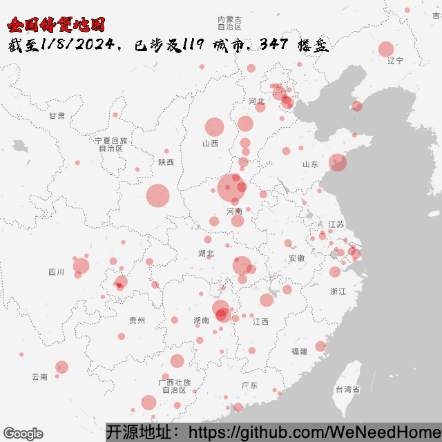
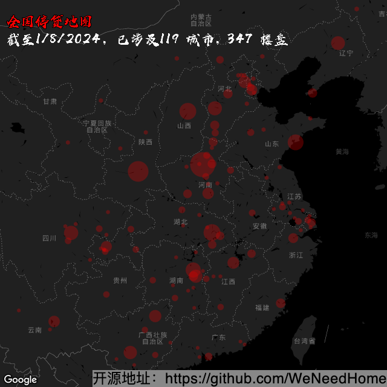

# 全国各省市烂尾楼停贷断供通知汇总

## 数据来源统计以及发起人： 已被封禁

*非专业精确数据，仅供参考，与数据模糊分析*

*数据开放转载引用，但请注明出处，非常感谢！*

*这里不做任何非数据性质等其他一系列讨论，只是统计一个数据，有错就纠改，无其他任何含义，别的请勿多言！禁止政治敏感话题！*

*要相信党，相信政府。党和政府一定会给人民群众一个满意的交代，这里仅作数据统计，切勿有过激言论！*

[--> 毛主席在 1962 年七千人大会上的讲话](https://www.marxists.org/chinese/maozedong/1968/5-016.htm)

[--> 互帮互助留言讨论区=>](https://github.com/WeNeedHome/SummaryOfLoanSuspension/discussions)
（遵守规则拒绝政治敏感，不然会再次关闭 discussion。）

[--> 相关法律与审判案例支持](相关法律与审判案例支持.md)

## 项目协同

### 计划

[--> TODO](./TODO.md)

### 提交

1. [--> 1. 新手请看：如何提交项目信息](PR-instruction.md)
2. [--> 2. 添加请看：新增停贷项目规范](CONTRIBUTING.md)
3. [--> 3. 冲突请看：如何修正提交冲突](PR-resolving-conflicts.md)

其中，提交之前请确保验证能过：

```shell
sh ./run-validate.sh
```

### 开发

- [--> 后端](development/backend/README.md)
- [--> 前端](development/frontend/README.md)

1. :sparkles:
   本项目已集成CI，将自动核验数据的统计准确性，具体见：[backend-nodejs](./development/backend/nodejs/README.md)

2. :rocket: 20220719
   已实现开发商数据抓取，但还需要更多的单元测试与样本测试，具体见：[爬虫开发者急集令🚀 #950](https://github.com/WeNeedHome/SummaryOfLoanSuspension/discussions/950)

3. :zap: 20220720 升级 readme 文档，已支持（与推荐）换行编辑楼盘信息

4. 20220721：
   1. :rocket: 增加了一个基于 dotnet 实现的 GitHub proxy，详见 [#953](https://github.com/WeNeedHome/SummaryOfLoanSuspension/pull/953)
   2. :sparkles: 升级了地图，显示中文水印，在 readme 中直接查看即可

## 数据概要

### 结构化数据

- [楼盘停贷数据(FLAT版)](data/generated/properties-flat.json)（含省市区、链接）
- [楼盘停贷数据(TREE版)](data/generated/properties-tree.json)（含省市区、链接）
- [城市停贷数据](data/generated/cities-for-visualization.json)（含省市区、楼盘统计数、经纬度）

### 全国停贷地图

<details>
<summary><b>点击查看：全国停贷地图（浅色）</b></summary>

</details>

<details>
<summary><b>点击查看：全国停贷地图（深色）</b></summary>

</details>

<details>
<summary><b>点击查看：在线地图！</b></summary>
我们做了一个在线地图，来让不方便使用 GitHub 的普通人看到这些数据。<br>
* 域名：https://building.lulaolu.com<br>
* 仓库：https://github.com/ritajie/incomplete-projects

欢迎来为这个地图做贡献！

</details>

### 其他数据公示处

- ~~项目发起人~~ (被 ban 了）

- ~~[我来文档](https://www.wolai.com/xutejcDgz9B3aTcrRCjxB1)~~ （20220717已无查看权限）

- ~~[Notion 数据库](https://www.notion.so/21dab14200e2478eb91c49b68d16495f)~~ (
  20220717已被恶意删除)

## 分省数据 (总计：【**343+**】，按三级拼音升序）

### 安徽省 [ 2 ]

- **合肥市（2）：** 
  [恒大中心（8月）](images/安徽省/合肥市/合肥恒大中心全体业主强制停贷告知书.png),
  斯瑞大厦

### 北京市 [ 3 ]

- **朝阳区（1）：** 
  [上东郡（澜悦景苑）](images/北京市/朝阳区/澜悦景苑.jpeg)
- **石景山区（1）：** 
  [禧悦学府（悦创佳苑）](images/北京市/石景山区/禧悦学府.jpeg)
- **通州区（1）：** 
  [禹洲朗廷湾（朗廷雅苑）](images/北京市/通州区/北京禹洲朗廷湾.jpeg)

### 重庆市 [ 14 ]

- **巴南区（2）：** 
  恒大新城四期,
  [世茂·江城铭著](images/重庆市/巴南区/_世茂·江城铭著)
- **璧山区（1）：** 
  [璧山区融创城（9月）](images/重庆市/璧山区/重庆_璧山_融创城.jpg)
- **大渡口区（1）：** 
  [恒大麓山湖（9月）](images/重庆市/大渡口区/重庆市大渡口区恒大麓山湖业主强制停贷告知书.png)
- **黔江区（2）：** 
  富力院士延琅境,
  恒大名都（7月）
- **沙坪坝区（1）：** 
  [佳兆业·凤鸣水岸（9月）](images/重庆市/沙坪坝区/重庆_佳兆业凤鸣水岸.jpg)
- **万州区（2）：** 
  [天仙湖黄金海岸（10月）](images/重庆市/万州区/重庆市万州区天仙湖黄金海岸全体业主决定于2022年10月1日起强制停贷告知函.jpg),
  万萃城二期（12月）
- **渝北区（5）：** 
  芙蓉公馆（9月）,
  恒大轨道时代二期,
  蓝光未来城,
  [融创隐溪晓院一二三期](images/重庆市/渝北区/重庆市渝北区融创隐溪晓院全体业主强制停贷预告书.png),
  [阳光城未来悦二期（7月）](images/重庆市/渝北区/阳城未来悦二期.jpg)

### 福建省 [ 4 ]

- **福州市（4）：** 
  [恒大天璟二期](images/福建省/福州市/福州市恒大天璟二期全体业主决定于2022年8月强制停贷告知书.jpg),
  [平潭综合实验区金顺新光明城（9月）](images/福建省/福州市/平潭综合实验区金顺新光明城全体业主决定于2022年9月强制停贷告知书.jpg),
  [世茂泰禾青云小镇（9月）](images/福建省/福州市/永泰青云小镇千余户业主联名发布停贷告知书.png),
  [天泽奥莱时代（8月）](images/福建省/福州市/福州市奥莱时代.jpg)

### 甘肃省 [ 2 ]

- **兰州市（1）：** 
  [兰州新区绿地智慧金融城六期康养谷](images/甘肃省/兰州市/兰州新区绿地智慧金融城六期康养谷.jpeg)
- **庆阳市（1）：** 
  国金one（11月）

### 广东省 [ 8 ]

- **广州市（1）：** 
  [万科海上明月（9月）](images/广东省/广州市/gz001.png)
- **揭阳市（1）：** 
  恒大翡翠华庭二期
- **汕头市（1）：** 
  恒大金碧外滩湾（八月）
- **深圳市（3）：** 
  佳兆业时代大厦,
  [佳兆业樾伴山](images/广东省/深圳市/sz001.jpg),
  [前海天境花园](images/广东省/深圳市/sz003.jpg)
- **湛江市（1）：** 
  [吴川奥园冠军城一期](images/广东省/湛江市/_吴川奥园冠军城一期)
- **中山市（1）：** 
  泰禾金尊府

### 广西壮族自治区 [ 24 ]

- **北海市（1）：** 
  [融创海映兰屿三期](images/广西壮族自治区/北海市/广西北海市融创海映兰屿三期业主集体中止还贷告知书.png)
- **崇左市（1）：** 
  [广西扶绥恒大文化旅游康养城](images/广西壮族自治区/崇左市/广西扶绥恒大文化旅游康养城停贷告知书.png)
- **桂林市（7）：** 
  [桂林恒大城（10月）](images/广西壮族自治区/桂林市/桂林恒大城.jpg),
  [桂林融创文旅城N4地块](images/广西壮族自治区/桂林市/_桂林融创文旅城N4地块),
  灵川汇金万象新城（11月）,
  [融创文旅城N5地块（12月）](images/广西壮族自治区/桂林市/桂林融创文旅城N5地块揽云府西苑全体业主强制延期还贷告知书.png),
  [融创文旅城N7地块（10月）](images/广西壮族自治区/桂林市/桂林融创N7.png),
  [山水国际](images/广西壮族自治区/桂林市/山水国际和山水华庭停贷告知函.jpg),
  [山水华庭](images/广西壮族自治区/桂林市/山水国际和山水华庭停贷告知函.jpg)
- **柳州市（2）：** 
  [恒大城二期、三期](images/广西壮族自治区/柳州市/柳州恒大二三期停贷.jpg),
  [鹿寨县麓湖公园里](images/广西壮族自治区/柳州市/鹿寨县麓湖公园里全体业主决定于2022年8月20日强制停贷告知书.jpg)
- **南宁市（9）：** 
  [东鼎雍和府（9月）](images/广西壮族自治区/南宁市/南宁东鼎雍和府.png),
  江宇世纪公馆,
  金科博翠山,
  蓝光雍锦澜湾,
  [南宁恒大华府二期](images/广西壮族自治区/南宁市/南宁恒大华府二期告知书.png),
  融创融公馆11、12号楼（8月）,
  [五象澜庭府沁苑](images/广西壮族自治区/南宁市/南宁市五象澜庭府沁苑.png),
  五象澜庭府臻苑,
  [中鼎公园府](images/广西壮族自治区/南宁市/广西省南宁市中鼎公园府全体业主强制停贷告知书.png)
- **钦州市（1）：** 
  恒大御景半岛二期
- **梧州市（1）：** 
  [恒大绿洲二期（8月）](images/广西壮族自治区/梧州市/梧州恒大二期停贷.png)
- **玉林市（2）：** 
  [北流市三环新城二期](images/广西壮族自治区/玉林市/玉林北流市三环新城停贷.png),
  中鼎绿城中心

### 贵州省 [ 2 ]

- **贵阳市（2）：** 
  中环国际阅湖,
  [中天·吾乡](images/贵州省/贵阳市/_中天·吾乡)

### 河北省 [ 24 ]

- **保定市（3）：** 
  [隆基泰和涿州铂悦山](images/河北省/保定市/隆基泰和涿州铂悦山项目全体业主强制停贷告知书.jpeg),
  [隆基泰和涿州紫悦小区](images/河北省/保定市/涿州市隆基泰和紫悦小区.jpeg),
  上东御景
- **沧州市（1）：** 
  [紫樾香榭](images/河北省/沧州市/沧州市紫樾香榭全体业主强制停贷告知书.jpeg)
- **承德市（1）：** 
  状元府
- **邯郸市（2）：** 
  [恒大绿洲](images/河北省/邯郸市/邯郸恒大绿洲.jpg),
  [恒大悦珑湾](images/河北省/邯郸市/邯郸恒大.jpg)
- **廊坊市（5）：** 
  鸿坤凤凰城五期（8月）,
  鸿坤理想城,
  [华夏幸福·四季公馆](images/河北省/廊坊市/河北廊坊市大厂回族自治县四季公馆强制停贷告知书.jpeg),
  华夏幸福孔雀城大运河智慧街区（香河）,
  盈时·未来港
- **石家庄市（7）：** 
  [安联生态城凯旋府](images/河北省/石家庄市/石家庄市安联生态城凯旋府全体货款业主强制停货告知书.jpeg),
  恒大时代新城（8月）,
  恒大悦龙台,
  恒润中央广场,
  [融创城一期（11月）](images/河北省/石家庄市/石家庄融创城一期全体业主决定于2022年11月强制停贷告知书.png),
  [石家庄赫石府](images/河北省/石家庄市/石家庄市赫石府全体货款业主强制停货告知书.png),
  [众美定制广场](images/河北省/石家庄市/_众美定制广场)
- **邢台市（3）：** 
  恒大悦府,
  [天山熙湖二期_名玉家园（待停贷）](images/河北省/邢台市/天山熙湖二期_名玉家园停贷告知书.png),
  永康万国城
- **张家口市（2）：** 
  宣化恒大滨河左岸,
  宣化恒大翡翠湾

### 河南省 [ 69 ]

- **安阳市（2）：** 
  恒大悦府,
  紫薇公馆
- **鹤壁市（1）：** 
  [淇县建业城](images/河南省/鹤壁市/河南鹤壁市淇县建业城强制停贷告知书.jfif)
- **开封市（3）：** 
  [开封北大资源未名府一期](images/河南省/开封市/开封北大资源未名府一期全体业主决定于2022年8月一日强制停贷告知书.png),
  [开封北大资源紫境府二期](images/河南省/开封市/开封北大资源紫境府二期全体业主决定于2022年9月一日强制停贷告知书.png),
  [郑开恒大未来城三期](images/河南省/开封市/郑开恒大未来城三期全体业主决定于2022年8月份强制停贷告知书.png)
- **洛阳市（1）：** 
  恒大云湖上郡
- **漯河市（1）：** 
  恒大悦府
- **南阳市（3）：** 
  恒大御府,
  兴达珑府,
  阳光城丽景花园
- **商丘市（2）：** 
  恒大名都二期,
  名门城五期
- **新乡市（2）：** 
  平原新区恒大三期半城湖（8月）,
  [新乡市豫飞盛世城邦（8月）](images/河南省/新乡市/新乡豫飞盛世城邦.jpg)
- **荥阳市（1）：** 
  居易西郡
- **许昌市（2）：** 
  金科鹿鸣帝景,
  融创观河宸院
- **郑州市（45）：** 
  奥园御湖城,
  奥园悦城（汇景园）,
  [瀚海航城](images/河南省/郑州市/瀚海航城告知书.png),
  瀚海思念城,
  浩创梧桐茗筑（7月）,
  恒大城,
  恒大养生谷,
  华纳龙熙湾,
  [金水区康桥东麓园二期](images/河南省/郑州市/郑州市金水区康桥东麓园二期全体业主于2022年10月1日强制停贷告知书.jpeg),
  锦艺轻纺四期未来公寓,
  [九裕龙城](images/河南省/郑州市/九裕龙城.jpeg),
  康桥玖玺园,
  [康桥那云溪（8月)](images/河南省/郑州市/新郑龙湖康桥那云溪.jpg),
  康桥未来公元,
  康桥香溪郡,
  [康桥悦溪园](images/河南省/郑州市/郑州康桥悦溪园.png),
  康桥阅溪雅苑,
  [孔雀城公园海](images/河南省/郑州市/郑州孔雀城公园海.png),
  [蓝宝桃源里](images/河南省/郑州市/蓝宝桃源里全体业主强制停贷告知书.png),
  龙湖锦艺城高六,
  龙湖一号（9月）,
  绿地滨湖国际城,
  绿地城二区（7月）,
  [绿地城五期六区（7月）](images/河南省/郑州市/郑州绿地城五期六区停贷声明.jpg),
  绿地溱水小镇,
  名门翠园,
  名门天境,
  名门紫园,
  啟福城,
  清华城（7月）,
  [融创中原大观二期](images/河南省/郑州市/郑州市融创中原大观二期停贷告知书.png),
  盛润城壹号公馆,
  [盛世卧龙城三期（10月）](images/河南省/郑州市/郑州市中原区盛世卧龙城三期.jpg),
  [泰山誉景朗誉园](images/河南省/郑州市/泰山誉景全体业主决定于2022年9月强制停贷告知书.jpeg),
  [威龙尚品13号楼（10月底三期烂尾三年停贷）](images/河南省/郑州市/郑州新郑威龙尚品13号楼全体业主强制停贷告知书.jpeg),
  [新郑市浩创城](images/河南省/郑州市/浩创城告知书.png),
  [鑫苑金水观城](images/河南省/郑州市/郑州市鑫苑金水观城.jpg),
  [鑫苑名城3号院住宅](images/河南省/郑州市/郑州鑫苑名城3号院住宅项目.png),
  永恒理想世界三期（9月）,
  [豫发白鹭源春晓三期](images/河南省/郑州市/郑州航空港区豫发白鹭源春晓三期全体业主停贷告知书.jpg),
  [正商玖号院](images/河南省/郑州市/_新郑市正商（龙湖）玖号院),
  郑西鑫苑名家四期（7月）,
  [郑州融创御湖宸院三期](images/河南省/郑州市/郑州融创御湖宸院三期.png),
  [郑州新田城湖光里二期(原洞林文苑)](images/河南省/郑州市/郑州新田城湖光里二期（原洞林文苑）.jpg),
  [郑州鑫苑国际新城](images/河南省/郑州市/郑州鑫苑国际新城.jpg)
- **周口市（1）：** 
  槐府六号三期
- **驻马店市（5）：** 
  [恒大悦府](images/河南省/驻马店市/驻马店恒大悦府.png),
  佳和新城,
  平舆县湖珀蓝岸（10月）,
  遂平县绿地苑,
  中原城

### 湖北省 [ 25 ]

- **鄂州市（3）：** 
  鄂州市花样年香门第,
  恒大童世界四号地（廊桥水乡）（9月）,
  恒大文化旅游城
- **荆门市（1）：** 
  实地紫薇雅著
- **随州市（1）：** 
  恒大悦龙台（10月）
- **武汉市（14）：** 
  [奥山汉口澎湃城](images/湖北省/武汉市/武汉东西湖奥山汉口澎湃城.jpg),
  奥山经开澎湃城（7月）,
  [奥山首府](images/湖北省/武汉市/奥山首府（奥山郡）.png),
  [当代铭山筑(人福国际健康城)（7月）](images/湖北省/武汉市/人福国际健康城.png),
  [光谷绿地中心城JKL地块](images/湖北省/武汉市/光谷绿地中心城JKL地块.png),
  [汉南绿地城二期](images/湖北省/武汉市/汉南绿地城二期.png),
  [恒大科技城（8月）](images/湖北省/武汉市/恒大科技旅游城.png),
  [恒大龙城四期](images/湖北省/武汉市/恒大龙城四期.png),
  [恒大时代新城（8月）](images/湖北省/武汉市/恒大时代新城.png),
  [绿地光谷星河绘](images/湖北省/武汉市/绿地光谷星河绘.jpg),
  绿地光谷中心城,
  [美好香域花境](images/湖北省/武汉市/美好香域花境.jpg),
  泰禾知音湖院子（君悦花园）,
  新洲中新盛景
- **咸宁市（3）：** 
  恒大名都,
  联乐广场,
  绿地城际空间站
- **襄阳市（2）：** 
  恒大翡翠龙庭一期（8月）,
  蓝光雍锦园
- **孝感市（1）：** 
  润达·壹号广场

### 湖南省 [ 34 ]

- **常德市（1）：** 
  [汉寿县山湖海上城二期、三期](images/湖南省/常德市/常德市汉寿县山湖海上城二期、三期全体业主停贷告知书.jpeg)
- **郴州市（1）：** 
  [郴州鲲鹏商贸城](images/湖南省/郴州市/郴州鲲鹏商贸城强制停贷通知.png)
- **衡东县（1）：** 
  奥体公馆
- **衡阳市（1）：** 
  华源北街
- **怀化市（2）：** 
  恒大帝景,
  恒大中央广场（8月）
- **浏阳市（1）：** 
  恒大华府四期
- **邵阳市（1）：** 
  恒大华府（9月）
- **湘潭市（4）：** 
  [和达滨江公园](images/湖南省/湘潭市/湘潭市和达滨江花园强制停贷书.jpg),
  恒大书香门第15、16栋,
  [金奥湘江公馆](images/湖南省/湘潭市/湘潭金奥湘江公馆一二期停贷告知函.jpg),
  湘台国际花园二期
- **永州市（2）：** 
  [道县东方丽都三期（永州道县）](images/湖南省/永州市/关于道县东方丽都强制停贷告知书.png),
  舜德湘江
- **岳阳市（1）：** 
  恒大未来城二期（8月）
- **长沙市（11）：** 
  滨江正荣紫阙台,
  [富力园康商业广场](images/湖南省/长沙市/长沙富力园康商业广场全体业主决定于2022年11月强制停贷告知书.jpeg),
  合能枫丹宸悦,
  合能湘江公馆,
  恒大滨江左岸,
  恒大御景天下二期（8月）,
  恒大悦湖商业广场（12月）,
  [恒泰芙蓉悦府](images/湖南省/长沙市/湖南省长沙市恒泰芙蓉悦府全体业主停贷告知书.jpg),
  [宁乡未来方舟2期&3期](images/湖南省/长沙市/宁乡未来方舟.jpg),
  新力铂园（8月）,
  长沙文景
- **株洲市（8）：** 
  北大资源翡翠公园,
  诚建檀香山,
  [东成中心1栋](images/湖南省/株洲市/株洲东成中心1栋全体业主决定于2022年9月强制停贷告知书.jpg),
  [华晨格林水岸二三期](images/湖南省/株洲市/湖南省株洲市华晨格林水岸二三期.png),
  [华晨金水湾三四期](images/湖南省/株洲市/湖南株洲.jpg),
  [华晨神农府](images/湖南省/株洲市/株洲市华晨神农府全体业主强制停货告知书.jpeg),
  华晨神农湾,
  绿地城际空间站

### 吉林省 [ 1 ]

- **公主岭市（1）：** 
  恒大花溪谷或水世界

### 江苏省 [ 12 ]

- **常州市（1）：** 
  三盛璞悦湾
- **连云港市（1）：** 
  [恒泰悦珑府](images/江苏省/连云港市/恒泰悦珑府.png)
- **南京市（1）：** 
  金陵华夏中心（8月）
- **南通市（1）：** 
  阳光城未来悦
- **苏州市（2）：** 
  [泰禾金尊府（8月)](images/江苏省/苏州市/苏州泰禾金尊府.jpg),
  [阳光城檀苑](images/江苏省/苏州市/苏州阳光城檀苑.jpg)
- **宿迁市（1）：** 
  恒大悦澜湾
- **泰州市（1）：** 
  恒大御景半岛
- **无锡市（1）：** 
  [天渝骄园](images/江苏省/无锡市/wuxi_天渝骄园.png)
- **扬州市（1）：** 
  [恒大观澜府](images/江苏省/扬州市/扬州恒大观澜府.jpg)
- **镇江市（2）：** 
  恒大童世界,
  [句容市宝华镇泰禾金尊府](images/江苏省/镇江市/镇江市句容市宝华镇-泰禾金尊府.jpg)

### 江西省 [ 15 ]

- **赣州市（2）：** 
  绿地博览城,
  [于都县恒大御景北区](images/江西省/赣州市/赣州市于都县恒大御景北区业主强制停贷告知书.png)
- **景德镇市（3）：** 
  恒大翡翠华庭,
  恒大珑庭,
  恒大悦府
- **南昌市（6）：** 
  恒大珺庭（8月）,
  恒大林溪府（10月）,
  鸿海城（10月）,
  [世茂泰禾南昌院子](images/江西省/南昌市/_世茂泰禾南昌院子),
  新力城,
  中金中心
- **萍乡市（2）：** 
  恒大御府二期,
  庄和中央华府（10月）
- **新余市（1）：** 
  恒大翡翠华庭（9月）
- **宜春市（1）：** 
  恒大绿洲四期

### 辽宁省 [ 9 ]

- **大连市（3）：** 
  [大连市鑫创科技健康小镇（包括鑫苑藏龙首付一期、二期）](images/辽宁省/大连市/大连鑫苑.jpg),
  [融创海逸长洲](images/辽宁省/大连市/大连融创海逸长洲.jpg),
  香海滨城二期
- **沈阳市（6）：** 
  [恒大盛京珺庭](images/辽宁省/沈阳市/沈阳恒大盛京珺庭.png),
  恒大时代新城,
  [恒大文化旅游城](images/辽宁省/沈阳市/沈阳恒大文化旅游城全体业主强制停货告知书.jpeg),
  恒大西江天悦,
  [恒大中央广场](images/辽宁省/沈阳市/沈阳恒大中央广场.jpg),
  金科集美东方

### 内蒙古自治区 [ 1 ]

- **呼和浩特市（1）：** 
  香墅岭西区（10月）

### 宁夏回族自治区 [ 1 ]

- **银川市（1）：** 
  [恒大珺睿府](images/宁夏回族自治区/银川市/银川市恒大珺睿府.png)

### 山东省 [ 12 ]

- **济南市（2）：** 
  [融创中新国际城四期南区](images/山东省/济南市/融创中新国际城四期南区.jpeg),
  [阳光城檀悦](images/山东省/济南市/阳光城檀悦.jpeg)
- **青岛市（8）：** 
  [黄岛蓝光雍锦半岛（6月)](images/山东省/青岛市/蓝光雍锦半岛.jpeg),
  [胶州协信天骄云麓](images/山东省/青岛市/胶州协信天骄云麓.jpeg),
  [绿地城际空间站（9月）](images/山东省/青岛市/绿地城际空间站.png),
  [青岛海洋活力区融创中心三期（10月）](images/山东省/青岛市/青岛海洋活力区融创中心三期.png),
  [三盛国际海岸五期（9月）](images/山东省/青岛市/三盛国际.jpeg),
  [实地蔷薇国际](images/山东省/青岛市/实地蔷薇国际.jpeg),
  [西海岸新区世茂•香奈公馆（10月）](images/山东省/青岛市/_西海岸新区世茂•香奈公馆),
  [中南林樾小区（7月）](images/山东省/青岛市/李沧中南林樾.jpg)
- **烟台市（1）：** 
  [松隽阳光城（12月）](images/山东省/烟台市/松隽阳光城.jpeg)
- **淄博市（1）：** 
  [恒大养生谷](images/山东省/淄博市/_淄博恒大养生谷)

### 山西省 [ 10 ]

- **太原市（10）：** 
  宝能城一期（8月）,
  [恒大滨河府二期](images/山西省/太原市/太原恒大滨河府二期全体业主决定千2022年9月强制停贷告知书.jpeg),
  恒大金碧天下八期（10月）,
  恒大金碧天下五期（八月）,
  [恒大森林海一期](images/山西省/太原市/太原恒大森林海一期全体业主强制停贷告知书.jpeg),
  [绿地新里城二期](images/山西省/太原市/太原绿地新里程.jpg),
  [太原富力天禧城3期](images/山西省/太原市/太原市富力天禧城3期.jpg),
  [太原市恒大御景湾4期](images/山西省/太原市/太原市恒大御景湾4期.jpg),
  [太原市融创中心](images/山西省/太原市/太原市融创中心.png),
  泰禾金尊府

### 陕西省 [ 25 ]

- **西安市（23）：** 
  [当代嘉宝公园悦](images/陕西省/西安市/当代嘉宝公园悦停贷告知书.png),
  [德杰状元府邸（9月）](images/陕西省/西安市/西安市_德杰状元府邸二期.jpg),
  [国际港务区绿地国港新里城一期（待停贷）](images/陕西省/西安市/西安国际港务区绿地国港新里城一期业主集体停贷告知书.jpeg),
  国际幸福城,
  鄠邑区名仕华庭,
  [锦业6号府邸](images/陕西省/西安市/西安锦业6号府邸停贷通知书.png),
  乐华城香榭庄园,
  [绿地璀璨天城二期](images/陕西省/西安市/西安国际港务区绿地璀璨天城B地块业主集体停贷告知书.jpeg),
  [绿地新里程三期兰亭公馆](images/陕西省/西安市/西安绿地兰亭公馆全体业主强制停贷告知书.png),
  [融创东方宸院DK5](images/陕西省/西安市/西安市新城区融创东方宸院DK5停贷告知书.jpeg),
  [世茂璀璨倾城二期（7月）](images/陕西省/西安市/_世茂璀璨倾城二期),
  [万和郡](images/陕西省/西安市/西安万和郡停贷告知.png),
  [西安灞桥区易合坊（相关报道）](https://new.qq.com/omn/20220322/20220322A02T2500.html),
  [西安当代境MOMA](images/陕西省/西安市/西安当代境MOMA项目预停贷告知书.png),
  [西安沣东新城君合天玺](images/陕西省/西安市/西安沣东新城君合天玺.jpeg),
  [西安恒大文化旅游城（8月）](images/陕西省/西安市/西安恒大文化旅游城强制停贷告知书.jpeg),
  [西安康桥悦蓉园（9）](images/陕西省/西安市/西安康桥悦蓉园13号楼停贷告知函.png),
  [西安名京院望](images/陕西省/西安市/西安名京院望停贷告知书.jpg),
  西安铭鸿中心二期,
  [西安远洋合能枫丹唐悦二期（待停贷）](images/陕西省/西安市/西安远洋合能枫丹唐悦二期强制停贷告知书.jpeg),
  阳光100阿尔勒（8月）,
  [正荣紫阙峯著（紫阙台东西区）](images/陕西省/西安市/西安正荣紫阙峯著全体业主强制停贷告知书.png),
  [中南上悦城四期](images/陕西省/西安市/西安市西咸新区中南上悦城四期停贷告知书.png)
- **咸阳市（1）：** 
  [融创御河宸院DK6](images/陕西省/咸阳市/咸阳融创御河宸院DK6全体业主停货告知书.png)
- **延安市（1）：** 
  [延安融创宸院](images/陕西省/延安市/_延安融创宸院)

### 上海市 [ 7 ]

- **崇明区（1）：** 
  [崇明长兴岛泰禾大城小院](images/上海市/崇明区/泰禾大城小院.png)
- **奉贤区（1）：** 
  [上海市奉贤区泰禾海上院子](images/上海市/奉贤区/上海市奉贤区泰禾海上院子.jpg)
- **嘉定区（2）：** 
  [嘉定南翔绿茵城市广场](images/上海市/嘉定区/嘉定绿茵城市广场.png),
  [徐行佳兆业五期](images/上海市/嘉定区/上海徐行佳兆业五期.jpeg)
- **浦东新区（3）：** 
  [临港万祥颐景园江南院](images/上海市/浦东新区/上海临港万祥颐景园江南院.jpeg),
  [上海浦东新区君御公馆](images/上海市/浦东新区/上海浦东新区君御公馆停贷通知书.png),
  [周浦合富广场](images/上海市/浦东新区/合富广场停贷通知.png)

### 四川省 [ 18 ]

- **巴中市（1）：** 
  恩阳川旅世纪外滩
- **成都市（9）：** 
  [恒大林溪郡（8月）](images/四川省/成都市/hdlxj.jpg),
  [恒大牧云天峰（8月）](images/四川省/成都市/成都新津恒大牧云天峰.jpg),
  [恒大未来城4期（7月）](images/四川省/成都市/成都市温江区恒大未来城4期.jpg),
  [三盛翡俪山（8月）](images/四川省/成都市/ssfls.jpg),
  [万锦熙岸2期（8月）](images/四川省/成都市/wjxa2.png),
  [武侯新城当代璞誉（7月）](images/四川省/成都市/whxcdd.jpg),
  [新尚尚院（10月）](images/四川省/成都市/成都温江区新尚尚院告知书.png),
  [阳光城未来悦](images/四川省/成都市/成都阳光城未来悦.jpeg),
  置信逸都城（9月）
- **德阳市（1）：** 
  [恒大翡翠华庭](images/四川省/德阳市/四川德阳恒大翡翠华庭.jpg)
- **都江堰市（1）：** 
  [融创文旅滨江新区（8月）](images/四川省/都江堰市/都江堰市融创文旅滨江新区全体业主决定2022年8月30日强制停贷告知书.jpg)
- **广安市（1）：** 
  帝谷公园城三期
- **泸州市（1）：** 
  恒大翡翠湾
- **眉山市（2）：** 
  [恒大文化旅游城（10月）](images/四川省/眉山市/眉山市恒大文化旅游城3-14地块全体业主决定于.png),
  [眉山市彭山区融创水郡未来城（江口水镇）（10月）](images/四川省/眉山市/眉山市彭山区融创水郡未来城、江口水镇全体业主决定强制停贷告知书.png)
- **南充市（2）：** 
  [南充大合华府（8月）](images/四川省/南充市/南充大合华府.png),
  [南充逸合中央公园（8月）](images/四川省/南充市/南充逸合中央公园.png)

### 天津市 [ 9 ]

- **宝坻区（1）：** 
  [宝坻区实地海棠雅著圣景豪庭](images/天津市/宝坻区/天津市实地海棠雅著圣景豪庭.jpeg)
- **北辰区（2）：** 
  [融创津宸壹号](images/天津市/北辰区/天津市津宸壹号全体业主“动态还贷”告知书.png),
  [融创御景宸院](images/天津市/北辰区/天津市北辰区融创御景宸院全体业主强制停贷告知书.png)
- **津南区（1）：** 
  四季春晓
- **天津城区（4）：** 
  [融创南开宸院二期](images/天津市/天津城区/天津融创南开宸院二期住宅全体业主动态还贷告知书.jpg),
  实地海棠雅著圣景豪庭（8月）,
  实地蔷薇（9月）,
  [天津天房樾梅江住宅](images/天津市/天津城区/_天津天房樾梅江住宅)
- **武清区（1）：** 
  恒大翡翠湾（10月）

### 云南省 [ 8 ]

- **大理白族自治州（1）：** 
  [大理的小院子北区（12月）](images/云南省/大理白族自治州/_大理的小院子北区)
- **昆明市（6）：** 
  恒大城（9月）,
  恒大玖珑湾（9月）,
  恒大阳光半岛（9月）,
  佳兆业城市广场（9月）,
  蓝光德商天域（8月）,
  实地花鹤翎（10月）
- **玉溪市（1）：** 
  樱花谷（7月）

### 浙江省 [ 4 ]

- **杭州市（4）：** 
  [富阳区泰禾大城小院楼盘](images/浙江省/杭州市/浙江省杭州市富阳区泰禾大城小院楼盘富政储出（2010）20号地块购房者暂停还货告知书.jpg),
  [杭州中南春溪集](images/浙江省/杭州市/浙江杭州中南春溪集.png),
  [曲江新鸥鹏第三城（待停贷）](images/浙江省/杭州市/杭州市曲江新鸥鹏第三城停贷风险告知书.jpg),
  [中润璞玉公馆](images/浙江省/杭州市/中润璞玉公馆.png)

## 开发商总计 132（按拼音排序）（统计楼盘数 343）[数据源](data/source/extra-info.json)
<details>
<summary><b> 安徽斯瑞投资集团有限公司 【1】</b></summary>
  安徽省-合肥市-斯瑞大厦
</details>
<details>
<summary><b> 安联地产集团 【1】</b></summary>
  河北省-石家庄市-安联生态城凯旋府
</details>
<details>
<summary><b> 奥山集团有限公司 【3】</b></summary>
  湖北省-武汉市-奥山汉口澎湃城,<br>
  湖北省-武汉市-奥山经开澎湃城（7月）,<br>
  湖北省-武汉市-奥山首府
</details>
<details>
<summary><b> 奥园集团股份有限公司 【2】</b></summary>
  河南省-郑州市-奥园御湖城,<br>
  河南省-郑州市-奥园悦城（汇景园）
</details>
<details>
<summary><b> 百世金谷实业有限公司 【1】</b></summary>
  河北省-廊坊市-盈时·未来港
</details>
<details>
<summary><b> 宝能 【1】</b></summary>
  山西省-太原市-宝能城一期（8月）
</details>
<details>
<summary><b> 保定铭域房地产开发有限公司 【1】</b></summary>
  河北省-保定市-上东御景
</details>
<details>
<summary><b> 北大资源集团控股有限公司 【3】</b></summary>
  河南省-开封市-开封北大资源未名府一期,<br>
  河南省-开封市-开封北大资源紫境府二期,<br>
  湖南省-株洲市-北大资源翡翠公园
</details>
<details>
<summary><b> 北京鸿坤伟业房地产开发有限公司 【2】</b></summary>
  河北省-廊坊市-鸿坤凤凰城五期（8月）,<br>
  河北省-廊坊市-鸿坤理想城
</details>
<details>
<summary><b> 常熟市新源房地产有限责任公司 【1】</b></summary>
  上海市-嘉定区-嘉定南翔绿茵城市广场
</details>
<details>
<summary><b> 郴州市鲲鹏房地产开发有限公司 【1】</b></summary>
  湖南省-郴州市-郴州鲲鹏商贸城
</details>
<details>
<summary><b> 重庆德杰地产集团有限公司 【1】</b></summary>
  陕西省-西安市-德杰状元府邸（9月）
</details>
<details>
<summary><b> 重庆市天仙湖置业有限公司 【1】</b></summary>
  重庆市-万州区-天仙湖黄金海岸（10月）
</details>
<details>
<summary><b> 达县同盛房地产开发有限公司 【1】</b></summary>
  四川省-巴中市-恩阳川旅世纪外滩
</details>
<details>
<summary><b> 大合置业 【1】</b></summary>
  四川省-南充市-南充大合华府（8月）
</details>
<details>
<summary><b> 大连绿源房地产开发有限公司 【1】</b></summary>
  辽宁省-大连市-香海滨城二期
</details>
<details>
<summary><b> 当代置业（中国）有限公司 【2】</b></summary>
  陕西省-西安市-当代嘉宝公园悦,<br>
  陕西省-西安市-西安当代境MOMA
</details>
<details>
<summary><b> 道县华盈置业有限公司 【1】</b></summary>
  湖南省-永州市-道县东方丽都三期（永州道县）
</details>
<details>
<summary><b> 德龙房地产 【1】</b></summary>
  河北省-承德市-状元府
</details>
<details>
<summary><b> 富力 【3】</b></summary>
  重庆市-黔江区-富力院士延琅境,<br>
  湖南省-长沙市-富力园康商业广场,<br>
  山西省-太原市-太原富力天禧城3期
</details>
<details>
<summary><b> 广西江宇房地产有限责任公司 【1】</b></summary>
  广西壮族自治区-南宁市-江宇世纪公馆
</details>
<details>
<summary><b> 广西鹿寨祥瑞晟邦投资有限公司 【1】</b></summary>
  广西壮族自治区-柳州市-鹿寨县麓湖公园里
</details>
<details>
<summary><b> 广西三环企业集团股份有限公司 【1】</b></summary>
  广西壮族自治区-玉林市-北流市三环新城二期
</details>
<details>
<summary><b> 桂林市合凯实业有限公司 【2】</b></summary>
  广西壮族自治区-桂林市-山水国际,<br>
  广西壮族自治区-桂林市-山水华庭
</details>
<details>
<summary><b> 桂林市灵川县万象商贸城有限公司 【1】</b></summary>
  广西壮族自治区-桂林市-灵川汇金万象新城（11月）
</details>
<details>
<summary><b> 浩创置业集团有限公司 【2】</b></summary>
  河南省-郑州市-浩创梧桐茗筑（7月）,<br>
  河南省-郑州市-新郑市浩创城
</details>
<details>
<summary><b> 合能地产 【3】</b></summary>
  湖南省-长沙市-合能枫丹宸悦,<br>
  湖南省-长沙市-合能湘江公馆,<br>
  陕西省-西安市-西安远洋合能枫丹唐悦二期（待停贷）
</details>
<details>
<summary><b> 河北永康房地产开发集团有限公司 【1】</b></summary>
  河北省-邢台市-永康万国城
</details>
<details>
<summary><b> 河南安昇房地产有限公司 【1】</b></summary>
  河南省-郑州市-正商玖号院
</details>
<details>
<summary><b> 河南华纳置业股份有限公司 【1】</b></summary>
  河南省-郑州市-华纳龙熙湾
</details>
<details>
<summary><b> 河南九裕置业有限公司 【1】</b></summary>
  河南省-郑州市-九裕龙城
</details>
<details>
<summary><b> 河南美商置业有限公司 【1】</b></summary>
  河南省-郑州市-龙湖一号（9月）
</details>
<details>
<summary><b> 河南省翰高置业有限公司 【1】</b></summary>
  河南省-周口市-槐府六号三期
</details>
<details>
<summary><b> 河南省林鑫实业有限公司 【1】</b></summary>
  河南省-郑州市-蓝宝桃源里
</details>
<details>
<summary><b> 河南省清华房地产开发有限公司 【1】</b></summary>
  河南省-郑州市-清华城（7月）
</details>
<details>
<summary><b> 河南省泰山岩土实业有限责任公司 【1】</b></summary>
  河南省-郑州市-泰山誉景朗誉园
</details>
<details>
<summary><b> 河南盛润置业集团有限公司 【1】</b></summary>
  河南省-郑州市-盛润城壹号公馆
</details>
<details>
<summary><b> 河南新田城置业有限公司 【1】</b></summary>
  河南省-郑州市-郑州新田城湖光里二期(原洞林文苑)
</details>
<details>
<summary><b> 河南兴达投资有限公司 【1】</b></summary>
  河南省-南阳市-兴达珑府
</details>
<details>
<summary><b> 河南易鑫置业有限公司 【1】</b></summary>
  河南省-驻马店市-佳和新城
</details>
<details>
<summary><b> 河南豫发集团有限公司 【1】</b></summary>
  河南省-郑州市-豫发白鹭源春晓三期
</details>
<details>
<summary><b> 河南纵鑫置业有限公司 【1】</b></summary>
  河南省-郑州市-盛世卧龙城三期（10月）
</details>
<details>
<summary><b> 恒大 【86】</b></summary>
  安徽省-合肥市-恒大中心（8月）,<br>
  重庆市-巴南区-恒大新城四期,<br>
  重庆市-大渡口区-恒大麓山湖（9月）,<br>
  重庆市-黔江区-恒大名都（7月）,<br>
  重庆市-渝北区-恒大轨道时代二期,<br>
  福建省-福州市-恒大天璟二期,<br>
  广东省-揭阳市-恒大翡翠华庭二期,<br>
  广东省-汕头市-恒大金碧外滩湾（八月）,<br>
  广西壮族自治区-崇左市-广西扶绥恒大文化旅游康养城,<br>
  广西壮族自治区-桂林市-桂林恒大城（10月）,<br>
  广西壮族自治区-柳州市-恒大城二期、三期,<br>
  广西壮族自治区-南宁市-南宁恒大华府二期,<br>
  广西壮族自治区-钦州市-恒大御景半岛二期,<br>
  广西壮族自治区-梧州市-恒大绿洲二期（8月）,<br>
  河北省-邯郸市-恒大绿洲,<br>
  河北省-邯郸市-恒大悦珑湾,<br>
  河北省-石家庄市-恒大时代新城（8月）,<br>
  河北省-石家庄市-恒大悦龙台,<br>
  河北省-石家庄市-恒润中央广场,<br>
  河北省-邢台市-恒大悦府,<br>
  河北省-张家口市-宣化恒大滨河左岸,<br>
  河北省-张家口市-宣化恒大翡翠湾,<br>
  河南省-安阳市-恒大悦府,<br>
  河南省-开封市-郑开恒大未来城三期,<br>
  河南省-洛阳市-恒大云湖上郡,<br>
  河南省-漯河市-恒大悦府,<br>
  河南省-南阳市-恒大御府,<br>
  河南省-商丘市-恒大名都二期,<br>
  河南省-新乡市-平原新区恒大三期半城湖（8月）,<br>
  河南省-郑州市-恒大城,<br>
  河南省-郑州市-恒大养生谷,<br>
  河南省-驻马店市-恒大悦府,<br>
  湖北省-鄂州市-恒大童世界四号地（廊桥水乡）（9月）,<br>
  湖北省-鄂州市-恒大文化旅游城,<br>
  湖北省-随州市-恒大悦龙台（10月）,<br>
  湖北省-武汉市-恒大科技城（8月）,<br>
  湖北省-武汉市-恒大龙城四期,<br>
  湖北省-武汉市-恒大时代新城（8月）,<br>
  湖北省-咸宁市-恒大名都,<br>
  湖北省-襄阳市-恒大翡翠龙庭一期（8月）,<br>
  湖南省-怀化市-恒大帝景,<br>
  湖南省-怀化市-恒大中央广场（8月）,<br>
  湖南省-浏阳市-恒大华府四期,<br>
  湖南省-邵阳市-恒大华府（9月）,<br>
  湖南省-湘潭市-恒大书香门第15、16栋,<br>
  湖南省-岳阳市-恒大未来城二期（8月）,<br>
  湖南省-长沙市-恒大滨江左岸,<br>
  湖南省-长沙市-恒大御景天下二期（8月）,<br>
  湖南省-长沙市-恒大悦湖商业广场（12月）,<br>
  吉林省-公主岭市-恒大花溪谷或水世界,<br>
  江苏省-宿迁市-恒大悦澜湾,<br>
  江苏省-泰州市-恒大御景半岛,<br>
  江苏省-扬州市-恒大观澜府,<br>
  江苏省-镇江市-恒大童世界,<br>
  江西省-赣州市-于都县恒大御景北区,<br>
  江西省-景德镇市-恒大翡翠华庭,<br>
  江西省-景德镇市-恒大珑庭,<br>
  江西省-景德镇市-恒大悦府,<br>
  江西省-南昌市-恒大珺庭（8月）,<br>
  江西省-南昌市-恒大林溪府（10月）,<br>
  江西省-萍乡市-恒大御府二期,<br>
  江西省-新余市-恒大翡翠华庭（9月）,<br>
  江西省-宜春市-恒大绿洲四期,<br>
  辽宁省-沈阳市-恒大盛京珺庭,<br>
  辽宁省-沈阳市-恒大时代新城,<br>
  辽宁省-沈阳市-恒大文化旅游城,<br>
  辽宁省-沈阳市-恒大西江天悦,<br>
  辽宁省-沈阳市-恒大中央广场,<br>
  宁夏回族自治区-银川市-恒大珺睿府,<br>
  山东省-淄博市-恒大养生谷,<br>
  山西省-太原市-恒大滨河府二期,<br>
  山西省-太原市-恒大金碧天下八期（10月）,<br>
  山西省-太原市-恒大金碧天下五期（八月）,<br>
  山西省-太原市-恒大森林海一期,<br>
  山西省-太原市-太原市恒大御景湾4期,<br>
  陕西省-西安市-西安恒大文化旅游城（8月）,<br>
  四川省-成都市-恒大林溪郡（8月）,<br>
  四川省-成都市-恒大牧云天峰（8月）,<br>
  四川省-成都市-恒大未来城4期（7月）,<br>
  四川省-德阳市-恒大翡翠华庭,<br>
  四川省-泸州市-恒大翡翠湾,<br>
  四川省-眉山市-恒大文化旅游城（10月）,<br>
  天津市-武清区-恒大翡翠湾（10月）,<br>
  云南省-昆明市-恒大城（9月）,<br>
  云南省-昆明市-恒大玖珑湾（9月）,<br>
  云南省-昆明市-恒大阳光半岛（9月）
</details>
<details>
<summary><b> 恒泰集团 【2】</b></summary>
  湖南省-长沙市-恒泰芙蓉悦府,<br>
  江苏省-连云港市-恒泰悦珑府
</details>
<details>
<summary><b> 衡阳市亚材房地产开发有限公司 【1】</b></summary>
  湖南省-衡阳市-华源北街
</details>
<details>
<summary><b> 宏信置业 【1】</b></summary>
  上海市-浦东新区-上海浦东新区君御公馆
</details>
<details>
<summary><b> 鸿海地产 【1】</b></summary>
  江西省-南昌市-鸿海城（10月）
</details>
<details>
<summary><b> 湖北联乐德胜投资管理有限公司 【1】</b></summary>
  湖北省-咸宁市-联乐广场
</details>
<details>
<summary><b> 湖南奥体置业有限公司 【1】</b></summary>
  湖南省-衡东县-奥体公馆
</details>
<details>
<summary><b> 湖南和达投资集团有限公司 【1】</b></summary>
  湖南省-湘潭市-和达滨江公园
</details>
<details>
<summary><b> 湖南红星天成房地产开发有限公司 【1】</b></summary>
  湖南省-长沙市-长沙文景
</details>
<details>
<summary><b> 湖南九华国际新城开发建设有限公司 【1】</b></summary>
  湖南省-湘潭市-金奥湘江公馆
</details>
<details>
<summary><b> 湖南省湘汇置业发展（集团）有限公司 【1】</b></summary>
  湖南省-永州市-舜德湘江
</details>
<details>
<summary><b> 花样年 【1】</b></summary>
  湖北省-鄂州市-鄂州市花样年香门第
</details>
<details>
<summary><b> 华夏幸福 【4】</b></summary>
  河北省-廊坊市-华夏幸福·四季公馆,<br>
  河北省-廊坊市-华夏幸福孔雀城大运河智慧街区（香河）,<br>
  河南省-郑州市-孔雀城公园海,<br>
  江苏省-南京市-金陵华夏中心（8月）
</details>
<details>
<summary><b> 佳兆业 【5】</b></summary>
  重庆市-沙坪坝区-佳兆业·凤鸣水岸（9月）,<br>
  广东省-深圳市-佳兆业时代大厦,<br>
  广东省-深圳市-佳兆业樾伴山,<br>
  上海市-嘉定区-徐行佳兆业五期,<br>
  云南省-昆明市-佳兆业城市广场（9月）
</details>
<details>
<summary><b> 建业地产股份有限公司 【1】</b></summary>
  河南省-鹤壁市-淇县建业城
</details>
<details>
<summary><b> 江苏中南建设集团股份有限公司 【3】</b></summary>
  山东省-青岛市-中南林樾小区（7月）,<br>
  陕西省-西安市-中南上悦城四期,<br>
  浙江省-杭州市-杭州中南春溪集
</details>
<details>
<summary><b> 江西中金黄金珠宝置业有限公司 【1】</b></summary>
  江西省-南昌市-中金中心
</details>
<details>
<summary><b> 金科地产集团股份有限公司 【3】</b></summary>
  重庆市-渝北区-芙蓉公馆（9月）,<br>
  河南省-许昌市-金科鹿鸣帝景,<br>
  辽宁省-沈阳市-金科集美东方
</details>
<details>
<summary><b> 锦业地产集团有限公司 【1】</b></summary>
  陕西省-西安市-锦业6号府邸
</details>
<details>
<summary><b> 锦艺置业集团有限公司 【3】</b></summary>
  河南省-郑州市-锦艺轻纺四期未来公寓,<br>
  河南省-郑州市-龙湖锦艺城高六,<br>
  四川省-广安市-帝谷公园城三期
</details>
<details>
<summary><b> 居易置业 【1】</b></summary>
  河南省-荥阳市-居易西郡
</details>
<details>
<summary><b> 康桥地产集团有限公司 【8】</b></summary>
  河南省-郑州市-金水区康桥东麓园二期,<br>
  河南省-郑州市-康桥玖玺园,<br>
  河南省-郑州市-康桥那云溪（8月),<br>
  河南省-郑州市-康桥未来公元,<br>
  河南省-郑州市-康桥香溪郡,<br>
  河南省-郑州市-康桥悦溪园,<br>
  河南省-郑州市-康桥阅溪雅苑,<br>
  陕西省-西安市-西安康桥悦蓉园（9）
</details>
<details>
<summary><b> 乐华恒业集团 【1】</b></summary>
  陕西省-西安市-乐华城香榭庄园
</details>
<details>
<summary><b> 龙光集团 【1】</b></summary>
  广东省-深圳市-前海天境花园
</details>
<details>
<summary><b> 龙口市中宇房地产有限公司 【1】</b></summary>
  山东省-烟台市-松隽阳光城（12月）
</details>
<details>
<summary><b> 隆基泰和 【4】</b></summary>
  河北省-保定市-隆基泰和涿州铂悦山,<br>
  河北省-保定市-隆基泰和涿州紫悦小区,<br>
  河北省-沧州市-紫樾香榭,<br>
  陕西省-西安市-万和郡
</details>
<details>
<summary><b> 绿地 【18】</b></summary>
  重庆市-万州区-万萃城二期（12月）,<br>
  甘肃省-兰州市-兰州新区绿地智慧金融城六期康养谷,<br>
  河南省-郑州市-绿地滨湖国际城,<br>
  河南省-郑州市-绿地城二区（7月）,<br>
  河南省-郑州市-绿地城五期六区（7月）,<br>
  河南省-郑州市-绿地溱水小镇,<br>
  湖北省-武汉市-光谷绿地中心城JKL地块,<br>
  湖北省-武汉市-汉南绿地城二期,<br>
  湖北省-武汉市-绿地光谷星河绘,<br>
  湖北省-武汉市-绿地光谷中心城,<br>
  湖北省-咸宁市-绿地城际空间站,<br>
  湖南省-株洲市-绿地城际空间站,<br>
  江西省-赣州市-绿地博览城,<br>
  山东省-青岛市-绿地城际空间站（9月）,<br>
  山西省-太原市-绿地新里城二期,<br>
  陕西省-西安市-国际港务区绿地国港新里城一期（待停贷）,<br>
  陕西省-西安市-绿地璀璨天城二期,<br>
  陕西省-西安市-绿地新里程三期兰亭公馆
</details>
<details>
<summary><b> 美好置业集团股份有限公司 【1】</b></summary>
  湖北省-武汉市-美好香域花境
</details>
<details>
<summary><b> 名门地产 【4】</b></summary>
  河南省-商丘市-名门城五期,<br>
  河南省-郑州市-名门翠园,<br>
  河南省-郑州市-名门天境,<br>
  河南省-郑州市-名门紫园
</details>
<details>
<summary><b> 南充逸达置业有限公司 【1】</b></summary>
  四川省-南充市-南充逸合中央公园（8月）
</details>
<details>
<summary><b> 南宁市玉桶金房地产开发有限责任公司 【1】</b></summary>
  广西壮族自治区-南宁市-金科博翠山
</details>
<details>
<summary><b> 内蒙古鼎诚房地产开发有限责任公司 【1】</b></summary>
  内蒙古自治区-呼和浩特市-香墅岭西区（10月）
</details>
<details>
<summary><b> 平舆县豫丰置业有限公司 【1】</b></summary>
  河南省-驻马店市-平舆县湖珀蓝岸（10月）
</details>
<details>
<summary><b> 啟福置业股份有限公司 【1】</b></summary>
  河南省-郑州市-啟福城
</details>
<details>
<summary><b> 庆阳市万世房地产开发有限公司 【1】</b></summary>
  甘肃省-庆阳市-国金one（11月）
</details>
<details>
<summary><b> 融创 【24】</b></summary>
  重庆市-璧山区-璧山区融创城（9月）,<br>
  重庆市-渝北区-融创隐溪晓院一二三期,<br>
  广西壮族自治区-北海市-融创海映兰屿三期,<br>
  广西壮族自治区-桂林市-桂林融创文旅城N4地块,<br>
  广西壮族自治区-桂林市-融创文旅城N5地块（12月）,<br>
  广西壮族自治区-桂林市-融创文旅城N7地块（10月）,<br>
  广西壮族自治区-南宁市-融创融公馆11、12号楼（8月）,<br>
  河北省-石家庄市-融创城一期（11月）,<br>
  河南省-许昌市-融创观河宸院,<br>
  河南省-郑州市-融创中原大观二期,<br>
  河南省-郑州市-郑州融创御湖宸院三期,<br>
  辽宁省-大连市-融创海逸长洲,<br>
  山东省-济南市-融创中新国际城四期南区,<br>
  山东省-青岛市-青岛海洋活力区融创中心三期（10月）,<br>
  山西省-太原市-太原市融创中心,<br>
  陕西省-西安市-融创东方宸院DK5,<br>
  陕西省-咸阳市-融创御河宸院DK6,<br>
  陕西省-延安市-延安融创宸院,<br>
  四川省-都江堰市-融创文旅滨江新区（8月）,<br>
  四川省-眉山市-眉山市彭山区融创水郡未来城（江口水镇）（10月）,<br>
  天津市-北辰区-融创津宸壹号,<br>
  天津市-北辰区-融创御景宸院,<br>
  天津市-天津城区-融创南开宸院二期,<br>
  云南省-大理白族自治州-大理的小院子北区（12月）
</details>
<details>
<summary><b> 瑞新（平潭）投资有限公司 【1】</b></summary>
  福建省-福州市-平潭综合实验区金顺新光明城（9月）
</details>
<details>
<summary><b> 三盛控股（集团）有限公司 【3】</b></summary>
  江苏省-常州市-三盛璞悦湾,<br>
  山东省-青岛市-三盛国际海岸五期（9月）,<br>
  四川省-成都市-三盛翡俪山（8月）
</details>
<details>
<summary><b> 山湖海集团 【1】</b></summary>
  湖南省-常德市-汉寿县山湖海上城二期、三期
</details>
<details>
<summary><b> 陕西宏润实业集团有限公司 【1】</b></summary>
  陕西省-西安市-国际幸福城
</details>
<details>
<summary><b> 上海海东房地产有限公司 【1】</b></summary>
  上海市-浦东新区-临港万祥颐景园江南院
</details>
<details>
<summary><b> 上海兴宸房地产开发有限公司 【1】</b></summary>
  上海市-浦东新区-周浦合富广场
</details>
<details>
<summary><b> 石家庄中融汇通房地产开发有限公司 【1】</b></summary>
  河北省-石家庄市-石家庄赫石府
</details>
<details>
<summary><b> 实地地产集团有限公司 【7】</b></summary>
  河南省-安阳市-紫薇公馆,<br>
  湖北省-荆门市-实地紫薇雅著,<br>
  山东省-青岛市-实地蔷薇国际,<br>
  天津市-宝坻区-宝坻区实地海棠雅著圣景豪庭,<br>
  天津市-天津城区-实地海棠雅著圣景豪庭（8月）,<br>
  天津市-天津城区-实地蔷薇（9月）,<br>
  云南省-昆明市-实地花鹤翎（10月）
</details>
<details>
<summary><b> 世茂集团 【5】</b></summary>
  重庆市-巴南区-世茂·江城铭著,<br>
  福建省-福州市-世茂泰禾青云小镇（9月）,<br>
  江西省-南昌市-世茂泰禾南昌院子,<br>
  山东省-青岛市-西海岸新区世茂•香奈公馆（10月）,<br>
  陕西省-西安市-世茂璀璨倾城二期（7月）
</details>
<details>
<summary><b> 四川蓝光发展股份有限公司 【5】</b></summary>
  重庆市-渝北区-蓝光未来城,<br>
  广西壮族自治区-南宁市-蓝光雍锦澜湾,<br>
  湖北省-襄阳市-蓝光雍锦园,<br>
  山东省-青岛市-黄岛蓝光雍锦半岛（6月),<br>
  云南省-昆明市-蓝光德商天域（8月）
</details>
<details>
<summary><b> 泰禾 【8】</b></summary>
  广东省-中山市-泰禾金尊府,<br>
  湖北省-武汉市-泰禾知音湖院子（君悦花园）,<br>
  江苏省-苏州市-泰禾金尊府（8月),<br>
  江苏省-镇江市-句容市宝华镇泰禾金尊府,<br>
  山西省-太原市-泰禾金尊府,<br>
  上海市-崇明区-崇明长兴岛泰禾大城小院,<br>
  上海市-奉贤区-上海市奉贤区泰禾海上院子,<br>
  浙江省-杭州市-富阳区泰禾大城小院楼盘
</details>
<details>
<summary><b> 天房集团 【1】</b></summary>
  天津市-天津城区-天津天房樾梅江住宅
</details>
<details>
<summary><b> 天山房地产开发集团有限公司 【1】</b></summary>
  河北省-邢台市-天山熙湖二期_名玉家园（待停贷）
</details>
<details>
<summary><b> 天泽集团 【1】</b></summary>
  福建省-福州市-天泽奥莱时代（8月）
</details>
<details>
<summary><b> 万科 【1】</b></summary>
  广东省-广州市-万科海上明月（9月）
</details>
<details>
<summary><b> 吴川市盈润置业有限公司 【1】</b></summary>
  广东省-湛江市-吴川奥园冠军城一期
</details>
<details>
<summary><b> 武汉当代科技产业集团股份有限公司 【3】</b></summary>
  湖北省-武汉市-当代铭山筑(人福国际健康城)（7月）,<br>
  陕西省-西安市-西安沣东新城君合天玺,<br>
  四川省-成都市-武侯新城当代璞誉（7月）
</details>
<details>
<summary><b> 武汉千里丰房地产开发有限公司 【1】</b></summary>
  湖北省-武汉市-新洲中新盛景
</details>
<details>
<summary><b> 西安浩丰房地产开发有限公司 【1】</b></summary>
  陕西省-西安市-西安铭鸿中心二期
</details>
<details>
<summary><b> 西安名京房地产开发有限公司 【1】</b></summary>
  陕西省-西安市-西安名京院望
</details>
<details>
<summary><b> 西安曲江文化产业投资（集团）有限公司 【1】</b></summary>
  浙江省-杭州市-曲江新鸥鹏第三城（待停贷）
</details>
<details>
<summary><b> 西安双成置业有限公司 【1】</b></summary>
  陕西省-西安市-鄠邑区名仕华庭
</details>
<details>
<summary><b> 西安四德置业有限公司 【1】</b></summary>
  陕西省-西安市-西安灞桥区易合坊（相关报道）
</details>
<details>
<summary><b> 湘潭市花千树房地产开发有限公司 【1】</b></summary>
  湖南省-湘潭市-湘台国际花园二期
</details>
<details>
<summary><b> 孝感润达投资有限公司 【1】</b></summary>
  湖北省-孝感市-润达·壹号广场
</details>
<details>
<summary><b> 协信控股 【2】</b></summary>
  江苏省-无锡市-天渝骄园,<br>
  山东省-青岛市-胶州协信天骄云麓
</details>
<details>
<summary><b> 新城控股 【1】</b></summary>
  北京市-石景山区-禧悦学府（悦创佳苑）
</details>
<details>
<summary><b> 新力地产集团有限公司 【2】</b></summary>
  湖南省-长沙市-新力铂园（8月）,<br>
  江西省-南昌市-新力城
</details>
<details>
<summary><b> 新尚置业 【1】</b></summary>
  四川省-成都市-新尚尚院（10月）
</details>
<details>
<summary><b> 鑫苑 【5】</b></summary>
  河南省-郑州市-鑫苑金水观城,<br>
  河南省-郑州市-鑫苑名城3号院住宅,<br>
  河南省-郑州市-郑西鑫苑名家四期（7月）,<br>
  河南省-郑州市-郑州鑫苑国际新城,<br>
  辽宁省-大连市-大连市鑫创科技健康小镇（包括鑫苑藏龙首付一期、二期）
</details>
<details>
<summary><b> 阳光100 【1】</b></summary>
  陕西省-西安市-阳光100阿尔勒（8月）
</details>
<details>
<summary><b> 阳光城集团 【9】</b></summary>
  重庆市-渝北区-阳光城未来悦二期（7月）,<br>
  广西壮族自治区-南宁市-五象澜庭府沁苑,<br>
  广西壮族自治区-南宁市-五象澜庭府臻苑,<br>
  河南省-南阳市-阳光城丽景花园,<br>
  江苏省-南通市-阳光城未来悦,<br>
  江苏省-苏州市-阳光城檀苑,<br>
  山东省-济南市-阳光城檀悦,<br>
  四川省-成都市-阳光城未来悦,<br>
  天津市-津南区-四季春晓
</details>
<details>
<summary><b> 益华房地产 【1】</b></summary>
  贵州省-贵阳市-中环国际阅湖
</details>
<details>
<summary><b> 禹洲集团 【1】</b></summary>
  北京市-通州区-禹洲朗廷湾（朗廷雅苑）
</details>
<details>
<summary><b> 豫飞重工集团有限公司 【1】</b></summary>
  河南省-新乡市-新乡市豫飞盛世城邦（8月）
</details>
<details>
<summary><b> 云南澄德房地产开发有限公司 【1】</b></summary>
  云南省-玉溪市-樱花谷（7月）
</details>
<details>
<summary><b> 长沙润怡城乡开发建设有限公司 【1】</b></summary>
  湖南省-长沙市-宁乡未来方舟2期&3期
</details>
<details>
<summary><b> 正荣集团有限公司 【2】</b></summary>
  湖南省-长沙市-滨江正荣紫阙台,<br>
  陕西省-西安市-正荣紫阙峯著（紫阙台东西区）
</details>
<details>
<summary><b> 正阳县中原城置业集团有限公司 【1】</b></summary>
  河南省-驻马店市-中原城
</details>
<details>
<summary><b> 郑州黄河大观有限公司 【2】</b></summary>
  河南省-郑州市-瀚海航城,<br>
  河南省-郑州市-瀚海思念城
</details>
<details>
<summary><b> 郑州新威龙置业有限公司 【1】</b></summary>
  河南省-郑州市-威龙尚品13号楼（10月底三期烂尾三年停贷）
</details>
<details>
<summary><b> 郑州永恒控股集团有限公司 【1】</b></summary>
  河南省-郑州市-永恒理想世界三期（9月）
</details>
<details>
<summary><b> 置信集团 【1】</b></summary>
  四川省-成都市-置信逸都城（9月）
</details>
<details>
<summary><b> 中鼎集团 【3】</b></summary>
  广西壮族自治区-南宁市-东鼎雍和府（9月）,<br>
  广西壮族自治区-南宁市-中鼎公园府,<br>
  广西壮族自治区-玉林市-中鼎绿城中心
</details>
<details>
<summary><b> 中海地产集团有限责任公司 【1】</b></summary>
  四川省-成都市-万锦熙岸2期（8月）
</details>
<details>
<summary><b> 中交地产股份有限公司 【1】</b></summary>
  北京市-朝阳区-上东郡（澜悦景苑）
</details>
<details>
<summary><b> 中润控股集团（中国）有限公司 【1】</b></summary>
  浙江省-杭州市-中润璞玉公馆
</details>
<details>
<summary><b> 中天城投集团乌当房地产开发有限公司 【1】</b></summary>
  贵州省-贵阳市-中天·吾乡
</details>
<details>
<summary><b> 众美投资集团有限公司 【1】</b></summary>
  河北省-石家庄市-众美定制广场
</details>
<details>
<summary><b> 株洲诚建房地产开发有限公司 【1】</b></summary>
  湖南省-株洲市-诚建檀香山
</details>
<details>
<summary><b> 株洲华晨房地产开发有限责任公司 【4】</b></summary>
  湖南省-株洲市-华晨格林水岸二三期,<br>
  湖南省-株洲市-华晨金水湾三四期,<br>
  湖南省-株洲市-华晨神农府,<br>
  湖南省-株洲市-华晨神农湾
</details>
<details>
<summary><b> 株洲塔山房地产开发有限公司 【1】</b></summary>
  湖南省-株洲市-东成中心1栋
</details>
<details>
<summary><b> 驻马店市景宜置业有限公司 【1】</b></summary>
  河南省-驻马店市-遂平县绿地苑
</details>
<details>
<summary><b> 庄和集团 【1】</b></summary>
  江西省-萍乡市-庄和中央华府（10月）
</details>

## 其他曝光

- 梁溪本源(基本停工), 协信城立方(停工一年多),新力翡翠湾, 梁溪官邸(停工半年)，见：[#900](https://github.com/WeNeedHome/SummaryOfLoanSuspension/pull/900)

- 四川省-都江堰市-恒大云锦华庭（9月）（缺告知书）

- 河北-邢台-皓顺壹号院，见：[#940](https://github.com/WeNeedHome/SummaryOfLoanSuspension/pull/940)

- [贵州中天未来方舟环球谷C1组团烂尾](others/中天未来方舟环球谷C1组团.jpeg)
  ，这楼盘停工两年了，中天城投已经被接管，5月份建了群和业主协调，应该是没告知书的了，http://sc.house.hexun.com/News/details/id/198910.html
  。具体见：[#828](https://github.com/WeNeedHome/SummaryOfLoanSuspension/pull/828)

- [河南安阳恒大未来城（待停贷）](others/_河南安阳恒大未来城)

- [湖北省恒大供应商、小微企业断贷停工告知书](others/湖北省恒大供应商、小微企业断贷停工告知书.png)

- 湖北省恒大科技旅游城5号地块逾期一年未交付，政府专班答应8/10交付 2栋楼，失信。整个5号地块预估说11月交付

- 赣榆区香港城、华中郡府等：这些盘已有十年以上历史，不知道相关业主利益是否解决，因此借此机会也放上来。具体见：[大家来说说赣榆的烂尾楼_赣榆吧_百度贴吧.pdf](others/【图片】大家来说说赣榆的烂尾楼_赣榆吧_百度贴吧.pdf)
。参考来源：https://tieba.baidu.com/p/4710142504

- 河南省-商丘市-鸿山美景 [图](https://user-images.githubusercontent.com/110381329/182118827-41b3e82a-0201-4254-8025-6ee729dcb23f.PNG)

- 山东省青岛市西海岸新区融创影都学府三期项目如不能在2022年9月30日之前全面复工，将采取动态还贷，[告知书](./others/山东省青岛市西海岸新区融创影都学府三期/青岛西海岸新区融创影都学府三期.jpeg)在此。

- 河北省-邯郸市-北湖尚水湾 [#65](https://github.com/WeNeedHome/SummaryOfLoanSuspension/pull/65)

- 河北省-三河市-天洋城同心圆，水岸花语，百世金谷产业基地二期 3个烂尾小区 [#110](https://github.com/WeNeedHome/SummaryOfLoanSuspension/pull/110)

- 湖北省-黄石市-黄石广场，开发商已破产！ [#134](https://github.com/WeNeedHome/SummaryOfLoanSuspension/pull/134) [图一](https://raw.githubusercontent.com/WeNeedHome/SummaryOfLoanSuspension/c798e3a792f58be11a522e1f024777e5cf27c56c/images/%E9%BB%84%E7%9F%B3%E5%B8%82%E9%BB%84%E7%9F%B3%E5%B9%BF%E5%9C%BA%E5%BC%80%E5%8F%91%E5%95%86%E7%A0%B4%E4%BA%A7%E7%83%82%E5%B0%BE%E5%9B%BE%E4%B8%80.png) [图二](https://raw.githubusercontent.com/WeNeedHome/SummaryOfLoanSuspension/c798e3a792f58be11a522e1f024777e5cf27c56c/images/%E9%BB%84%E7%9F%B3%E5%B8%82%E9%BB%84%E7%9F%B3%E5%B9%BF%E5%9C%BA%E5%BC%80%E5%8F%91%E5%95%86%E7%A0%B4%E4%BA%A7%E7%83%82%E5%B0%BE%E5%9B%BE%E4%BA%8C.png)

- 河北省-保定市-涞水新城华银城人才家园 [#159](https://github.com/WeNeedHome/SummaryOfLoanSuspension/pull/159)

- 天津市-[南开区凌宾路地铁B口西侧-融创宸院（华川园）](https://raw.githubusercontent.com/WeNeedHome/SummaryOfLoanSuspension/53d4a3fd467974d86d727ff3151132c67b4e8493/images/%E5%8D%97%E5%BC%80%E5%8C%BA%E8%9E%8D%E5%88%9B%E5%AE%B8%E9%99%A2.jpg)，[西青区津同公路与子牙桥交口-蓝光雍绵半岛](https://raw.githubusercontent.com/WeNeedHome/SummaryOfLoanSuspension/53d4a3fd467974d86d727ff3151132c67b4e8493/images/%E8%A5%BF%E9%9D%92%E5%8C%BA%E9%9B%8D%E7%BB%B5%E5%8D%8A%E5%B2%9B.jpg) 两个烂尾楼 [#161](https://github.com/WeNeedHome/SummaryOfLoanSuspension/pull/161)

- 河南省-许昌市-铂悦山，博林首府，恒大悦龙台 3个停工楼盘 [#234](https://github.com/WeNeedHome/SummaryOfLoanSuspension/pull/234)

- 河南省-三门峡市-航科城，开阳盛世，中海国际，春天城 4个烂尾项目 [#261](https://github.com/WeNeedHome/SummaryOfLoanSuspension/pull/261)

- 陕西省-西安市-贞观首府 [#262](https://github.com/WeNeedHome/SummaryOfLoanSuspension/pull/262)

- 湖北省-宜昌市-宜昌夷陵区恒大名都二期（2021.8停工）[#269](https://github.com/WeNeedHome/SummaryOfLoanSuspension/pull/269)

- 云南省-昆明市-永鑫哈弗中心（9月），锦艺昆明之光（10月）（缺告知书） [#272](https://github.com/WeNeedHome/SummaryOfLoanSuspension/pull/272)

- 湖北省-孝感市-云梦县衍泽新都 [#274](https://github.com/WeNeedHome/SummaryOfLoanSuspension/pull/274)

- 江苏省-扬州市-江都区金奥文昌公馆 开发商破产，监管资金已空，楼盘自去年已经停工 [开发商债权申报](https://user-images.githubusercontent.com/38778288/180631681-31d1acb2-a6d5-4650-8ad4-4ddc352a9641.jpeg)

- 重庆市-北碚区-融创映湖十里 烂尾楼盘

- 浙江省-杭州市-绿地柏澜晶舍(推广名:绿地亚洲公园) [#292](https://github.com/WeNeedHome/SummaryOfLoanSuspension/pull/292) [停工告知](https://raw.githubusercontent.com/WeNeedHome/SummaryOfLoanSuspension/0e560306424c6adfb67f13e12d3f4a3a7c3e06ff/images/%E7%BB%BF%E5%9C%B0%E6%9F%8F%E6%BE%9C%E6%99%B6%E8%88%8D%E5%BB%B6%E6%9C%9F%E4%BA%A4%E4%BB%98%E9%80%9A%E7%9F%A5%E4%B9%A6.jpg)

- 安徽省-合肥市-新站区正荣中心 目前该小区的配套项目已经烂尾，住宅已经交付部分 [#320](https://github.com/WeNeedHome/SummaryOfLoanSuspension/pull/320) [图一](https://raw.githubusercontent.com/WeNeedHome/SummaryOfLoanSuspension/16f3c43cf767c2b6d3ec2c4c459c6c14e0d00e9b/images/%E5%90%88%E8%82%A5%E6%96%B0%E7%AB%99%E5%8C%BA%E6%AD%A3%E8%8D%A3%E4%B8%AD%E5%BF%83.jpeg) [图二](https://raw.githubusercontent.com/WeNeedHome/SummaryOfLoanSuspension/16f3c43cf767c2b6d3ec2c4c459c6c14e0d00e9b/images/%E5%90%88%E8%82%A5%E6%96%B0%E7%AB%99%E5%8C%BA%E6%AD%A3%E8%8D%A3%E4%B8%AD%E5%BF%83%E7%83%82%E5%B0%BE%E6%94%BF%E5%BA%9C%E5%8F%8D%E9%A6%88.jpeg)

- 湖北省-武汉市-绿地大都会 [#520](https://github.com/WeNeedHome/SummaryOfLoanSuspension/pull/520)

- 江西省-抚州市-东乡区红星雅苑 10年未能办理房产证 [#565](https://github.com/WeNeedHome/SummaryOfLoanSuspension/discussions/565)

- 四川省-成都市-中海锦江城云熙二期，人居智荟城 [#586](https://github.com/WeNeedHome/SummaryOfLoanSuspension/pull/586)

- 重庆市-北碚区-北碚别墅群（小区名字不记得，在重庆北碚很出名） [#692](https://github.com/WeNeedHome/SummaryOfLoanSuspension/pull/692)

- 浙江省-杭州市-绿地众安宸瀚里（已结束） [#718](https://github.com/WeNeedHome/SummaryOfLoanSuspension/pull/718) [绿臻置业公告](https://user-images.githubusercontent.com/16377295/179204666-6df50f70-0e5f-401f-929b-b1de3dac2637.png)

- 广西省-南宁市-当代锦园3、5号楼 [#896](https://github.com/WeNeedHome/SummaryOfLoanSuspension/pull/896)

- 云南省-昆明市-别样幸福城 [#925](https://github.com/WeNeedHome/SummaryOfLoanSuspension/discussions/925)

- 广东省-汕头市-恒大金碧江湾6期 [#993](https://github.com/WeNeedHome/SummaryOfLoanSuspension/discussions/993) [图](https://user-images.githubusercontent.com/50266660/180631384-35f3a5da-97e8-4dcf-a98a-9ecf66c0823c.jpg)

- 广东省-深圳市-盐田佳兆业御璟佳园广场 [#1003](https://github.com/WeNeedHome/SummaryOfLoanSuspension/pull/1003)

- 福建省-建瓯市-恒大溪山公馆 [#1062](https://github.com/WeNeedHome/SummaryOfLoanSuspension/discussions/1062) 
